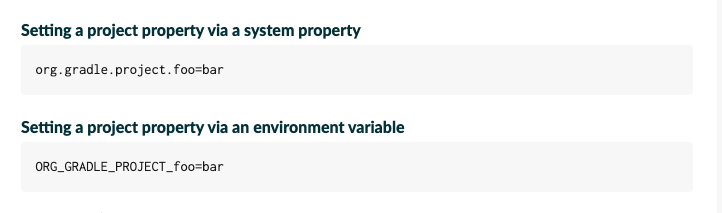

---
tags:
  - Spring-Boot
title: proejct property 설정하여 Spring boot profile 설정하기
---



위의 방법으로 gradle을 실행시킬 때 project property를 설정할 수 있다.

```java
SPRING_PROFILES_ACTIVE=local ./gradlew build sonarqube --info
```

위의 방법으로 gradle 빌드할 때 spring의 프로필을 설정할 수 있다.

## 참고 자료

[https://docs.gradle.org/current/userguide/build_environment.html#sec:project_properties](https://docs.gradle.org/current/userguide/build_environment.html#sec:project_properties)

[https://stackoverflow.com/questions/23367507/how-to-pass-system-property-to-gradle-task](https://stackoverflow.com/questions/23367507/how-to-pass-system-property-to-gradle-task)
