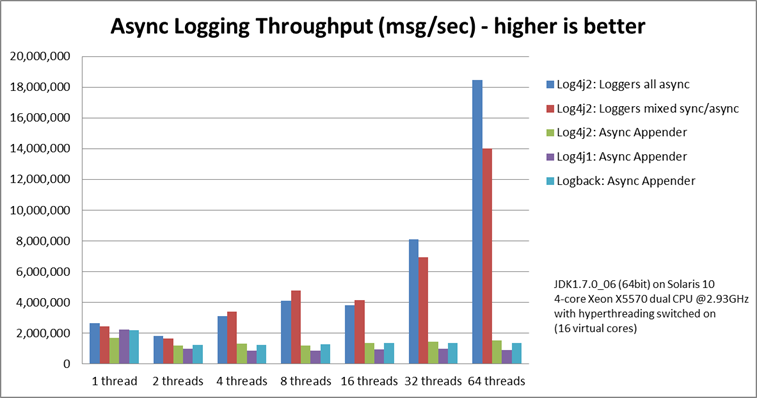

# log4j vs logback vs log4j2

Java 진영의 대표적인 로깅 프레임워크 log4j, logback, log4j2를 비교해보고자 한다.

## log4j

가장 오래된 로깅 프레임워크이다. 하지만 그만큼 몇 년 동안 가장 인기있는 프레임워기도하다. 최근에 나온 로깅 프레임워크도 log4j의 계층적 로그 레벨과 로거 같은 개념을 사용하고 있다. 

하지만, log4j는 2015년에 개발이 종료되었다. 새로운 프로젝트에서는 해당 프레임워크를 사용하는 것을 권장하지 않는다.

## logback

log4j의 후계자로 log4j와 같은 개발자가 만들었다. log4j와 전체적으로 동일한 개념을 사용하지만 성능이 개선되고 고급 필터링 및 설정 등을 제공하고 있다.

## log4j2

log4j와 logback을 모두 개선하여 만들어진 프레임워크다. 람다 표현식을 기반으로 Lazy Evaluation을 할 수 있고, 비동기 로거를 제공하여 지연 시간이 짧은 시스템을 구축할 수 있다. 비동기 로깅을 통해 엄청난 Throughput으로 로깅을 할 수 있다.

## 참고 자료

[https://stackify.com/compare-java-logging-frameworks/](https://stackify.com/compare-java-logging-frameworks/)

[https://junshock5.tistory.com/124](https://junshock5.tistory.com/124)