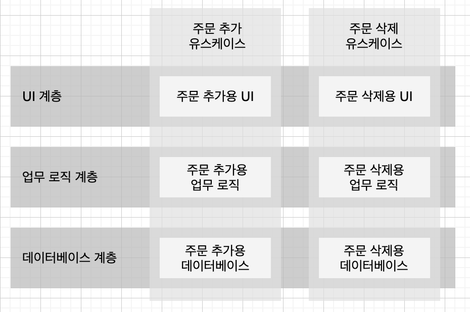
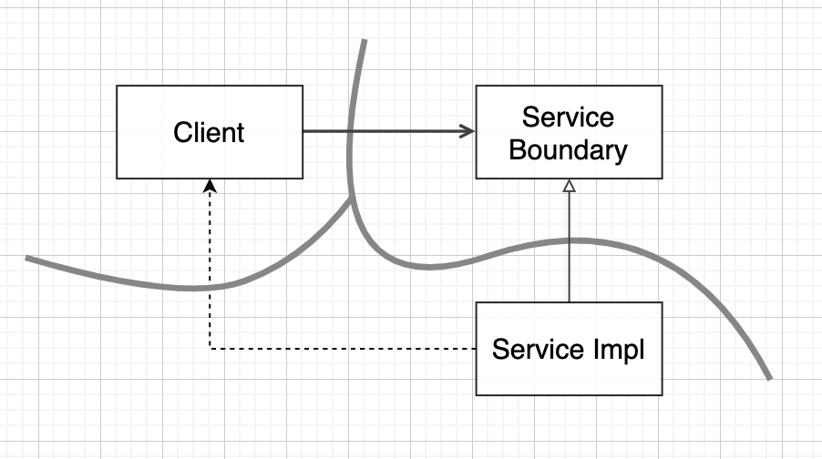
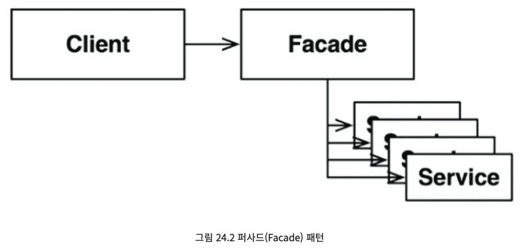
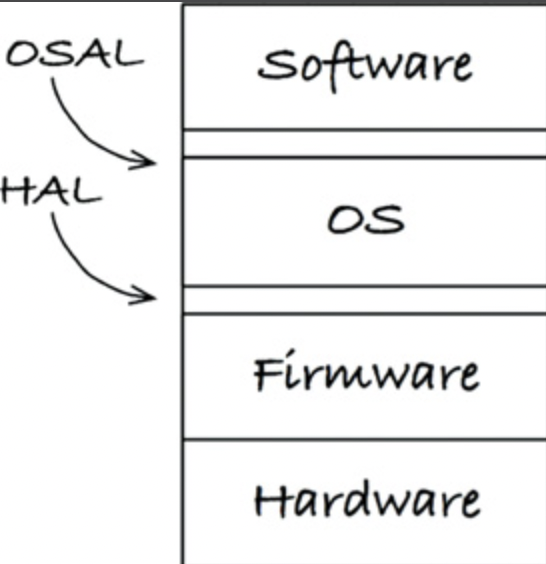

# 아키텍처

## 아키텍처란?

- 아키텍처의 주목적: 시스템의 생명주기 지원
  - 시스템을 쉽게 이해하고, 쉽게 개발하며, 쉽게 유지보수하고, 쉽게 배포하게 해준다.
- 팀 구조에 따라 아키텍처가 결정이 날 수도 있다.
  - 작은 규모의 팀이라면 모노리틱 시스템으로 개발할 수도 있다.
  - 팀 규모가 클 때, 안정된 인터페이스가 없고 잘 설계된 컴포넌트로 분리되어 있지 않다면 각 팀마다 하나씩 컴포넌트를 가질 가능성이 높다.
- 소프트웨어 아키텍처는 시스템을 단 한 번에 쉽게 배포할 수 있도록 만드는 데 목표를 두어야 한다.
  - 개발 초기 단계에 MSA를 사용하자고 결정할 경우, 컴퓨넌트 경계가 뚜렷해지고 인터페이스가 안정화되므로 시스템을 매우 쉽게 개발할 수 있다고 판단할 수 도 있다. 하지만, 배포할 시기가 되면 수많은 마이크로서비스를 발견하게 될지도 모른다.
- 아키텍처가 시스템 운영에 미치는 영향은 개발, 배포 유지보수에 미치는 영향보다는 덜 극적이다.
  - 시스템을 운영할 때 아키텍처가 맡은 또 다른 역할은 시스템을 운영하는데 필요한 요구를 개발자에게 알려준다.
  - 시스템 아키텍처는 유스케이스, 기능, 시스템의 필수 행위를 일급엔티티로 격창시키고, 이들 요소가 개발자에게 주요 목표로 인식되도록 해야 한다.
- 유지보수의 가장 큰 비용은 탐사와 이로 인한 위험부담에 있다.
  - 탐사: 기존 소프트웨어에 새로운 기능을 추가하거나 결함을 수정할 때, 소프트웨어를 파헤쳐서 어디를 고치는게 최선인지, 어떤 전략을 쓰는게 최적일지를 결정할 때 드는 비용
  - 아키텍처를 잘 설계하면 이 비용을 크게 줄일 수 있다.
- 좋은 아키텍트는 결정되지 않은 세부사항의 수를 최대화한다.
  - 소프트웨어 시스템의 두 가지 구성요소
    - 정책(policy): 모든 업무 규칙과 업무 절차를 구체화한 것.
    - 세부사항(detail): 사람, 외부 시스템, 프로그래머가 정책과 소통할 때 필요한 요소.
      - 예시: 입출력 장치, 데이터베이스, 웹 시스템, 서버, 프레임워크 ,통신 프로토콜 등

## 독립성

- 좋은 아키텍처가 지원해야되는 것

  - 시스템의 유스케이스
  - 시스템의 운영
  - 시스템의 개발
  - 시스템의 배포

- 유스케이스: 아키텍처는 시스템의 의도를 지원해야 한다.

  - 좋은 아키텍처는 행위를 명확히 하고 외부로 드러내며, 이를 통해 시스템이 지닌 의도를 아키텍처 수준에서 알아볼 수 있게 만드는 것이다.
  - 이런 행위는 일급 요소로 클래스, 함수, 모듈로서 아키텍처 내에 핵심적인 자리르 차지할 뿐만 아니라, 자신의 기능을 분명하게 설명하는 이름을 가질 것이다.

- 운영: 각 컴포넌트를 적절히 격리하고 컴포넌트 간 통신 방식을 특정 형태로 제한하지 않는다면, 시간이 지나 운영에 필요한 요구사항이 바뀌더라도 스레드, 프로세스, 서비스로 구성된 기술 스펙트럼 사이를 전환하는 일이 훨씬 쉬워질 것이다.

- 개발: 많은 팀으로 구성되며 관심사가 다양한 조직에서 어떤 시스템을 개발해야 한다면, 각 팀이 독립적으로 행동하기 편한 아키텍처를 반드시 확보하여 개발하는 동안 팀들이 서로를 방해하지 않도록 해야 한다.

  - 콘웨이의 법칙: 시스템을 설계하는 조직이라면 어디든지 그 조직의 의삭소통 구조와 동일한 구조의 설계를 만들어 낼 것이다.

- 배포: 좋은 아키텍처는 시스템이 빌드된 후 즉각 배포가 가능하다.

  - 좋은 아키텍처는 수십 개의 작은 설정 스크립트나 속성 파일을 약간씩 수정하는 방식을 사용하지 않는다.
  - 좋은 아키텍처는 꼭 필요한 디렉터리나 파일을 수작업으로 생성하게 내버려 두지 않는다.

- 좋은 아키텍처는 선택사항을 열어 둠으로써, 향후 시스템에 변경이 필요할 때 어떤 방향으로든 쉽게 변경할 수 있도록 한다.

- 아키텍트는 단일 책임 원칙과 공통 폐쇄 원칙을 적용하여, 그 의도의 맥락에 따라서 다른 이유로 변경되는 것들은 분리하고, 동일한 이유로 변경되는 것들은 묶는다. 이르 통해 서로 독립적으로 변경할 수 있도록 해야만 한다.

  - 서로 결합되지 않는 수평적인 계층: UI, 애플리케이션에 특화된 업무 규칙, 애플리케이션과 독립적인 업무 규칙, 데이터베이스 등
  - 유스케이스: 유스케이스는 수평적인 계층을 가로질러 수직적으로 분할할 수 있다. 유스케이스를 뒷 받침하는 UI와 데이터베이스를 서로 묶어서 각 유스케이스가 UI와 데이터베이스의 서로 다른 관점을 사용하게 되면, 새로운 유스케이스를 추가하더라도 기존 유스케이스에 영향을 주는 일은 거의 없을 것이다.
    - 유스 케이스로 분리하면 높은 대역폭을 요구하는 유스케이스는 여러 서버로 복제하여 실행할 수 있다. 이때 컴포넌트는 단일 프로세서의 동일한 주소 공간과 함꼐 상주하는 형태로 만들어져서는 안 된다.
    - 분리되어서 독립적으로 실행이 되어야하고, 일종의 네트워크를 통해 서로 통신하도록 하는 컴포넌트를 '서비스' 또는 '마이크로 서비스'라고 부른다.

  

- 중복에는 진짜 중복과 거짓된 중복이 있다.
  - 진짜 중복: 한 인스턴스가 변경되면, 동일한 변경을 그 인스턴스의 모든 복사본에 반드시 적영해야 하는 경우
  - 거짓된 중복: 중복으로 보이는 두 코드 영역이 서로 다른 속도와 다른 이유로 변경되는 경우
    - 거짓된 중복을 통합하지 않도록 유의해야한다. 그렇지 않으면 나중에 코드를 다시 분리하느라 큰 수고를 감수해야 한다.
- 계층과 유스케이스의 결합을 분리하는 방법 3가지
  - 소스 수준 분리 모드: 소스 코드 모듈 사이의 의존성을 제어
    - 하나의 모듈이 변하더라도 다른 모듈을 변경할 필요가 없다.
    - 모든 컴포넌트가 같은 주소 공간에 실행된다. (모노리틱 구조)
  - 배포 수준 분리 모드: jar 파일, DLL, 공유 라이브러라와 같이 배포 가능한 단위들 사이의 의존성을 제어
    - 한 모듈이 변하더라도 다른 모듈을 재빌드하거나 재배포 할 필요가 없다.
    - 많은 컴포넌트가 같은 주소 공간에 상주하며, 단순한 함수 호출을 통해 통신한다.
  - 서비스 수준 분리 모드: 의존하는 수준을 데이터 구조 단위까지 낮출 수 있고, 순전히 네트워크 패킷을 통해서만 통신
    - 모든 실행 가능한 단위는 소스와 바이너리 변경에 대해 완전히 독립적이다.
- 좋은 아키텍처는 시스템이 모노리틱 구조로 태어나더라도, 이후에는 독립적으로배포 가능한 단위들의 집합으로 성작하고 독립적인 서비스나 마이크로서비스 수준까지 성장할 수 있도록 만들어져야 한다.
  - 나중에 상황이 바뀌었을 때 이 진행방향을 거꾸로 돌려 모노리틱 구조로도 쉽게 되돌릴 수 있어야 한다.

## 경계: 선 긋기

- 소프트웨어 아키텍처는 선을 긋는 기술이며, 이러한 선을 경계(boundary)라고 부른다.
- 좋은 아키텍처란 결정을 가능한 한 최후의 순간에 내릴 수 있게 해주며, 결정에 따른 영향이 크지 않게 만든다.
  - 결정: 프레임워크, 데이터베이스, 웹 서버, 유틸리티 라이브러리, 의존성 주입 등
- 관련 있는 것과 없는 것 사이에 선을 긋는다. UI와 업무 규칙과는 관련이 없고, 데이터베이스는 UI와는 관련이 없다. 데이터베이스와 업무 규칙도 관련이 없다.
  - 업무 규칙이 알아야 할 것은 데이터를 가져오고 저장할 때 사용할 수 있는 함수 집합이 있다는 사실이 전부다. 이러한 함수 집합을 통해서 우리는 데이터베이스를 인터페이스 뒤로 숨길 수 있다.
  - GUI는 다른 종류의 인터페이스로 언제든지 교체할 수 있으며 업무 규칙은 전혀 개의치 않는다.
- 데이터베이스, UI, 업무규칙 사이에 선을 그으면서 플러그인 아키텍처 형태를 고려할 수 있다.
  - UI를 플러그인 형태로 연결할 수 있게 된다. 웹 기반일 수도 있고, 클라이언트/서버 기반이거나, SAO나 콘솔 기반, 또는 임의의 어떤 사용자 인터페이스 기술이라도 가능하다.
  - 데이터베이스를 플러그인 형태로 연결할 수 있게 된다. SQL, NoSQL, 파일 시스템 기반 데이터베이스, 또는 미래에 필요하리라 생각되는 임의의 어떤 종류의 데이터베이스 기술로도 대체할 수 있다.
- 경계는 변경의 축이 있는 지점에 그어진다. 경계의 한쪽에 위치한 컴포넌트는 경계 반대편의 컴포넌트와는 다른 속도로, 그리고 다른 이유로 변경된다.
- 소프트웨어 아키텍처에서 경계선을 그리려면 먼저 시스템을 컴포넌트 단위로 분할해야 한다.
  - 일부 컴포넌트는 핵심 업무 규칙에 해당한다.
  - 나머지 컴포넌트는 플러그인으로, 핵심 업무와는 직접적인 관련이 없지만 필수 기능을 포함한다.
  - 이는 의존성 역전 원칙과 안정된 추상화 원칙을 응용한 것임을 눈치챌 수 있어야한다.

## 경계 해부학

- 소스 수준 분리 모드(모놀리틱)

  - 배포 관점에서 볼 때 경계가 드러나지 않는다.
  - 단일 실행 파일에 포함된 다양한 컴포넌트를 독립적으로 수행하게 된다면, 서로의 영역에 침범하지 않은 채 자신만의 컴포넌트를 독립적으로 작업할 수 있다.
  - 모놀리틱에서 컴포넌트 간 통신을 매우 빠르고 값싸다. 통신은 전형적임 함수 호출에 지나지 않기 때문이다.

- 배포 수준 결합 분리

  - 컴포넌트가 배포되면 따로 컴파일하지 않고 곧바로 사용할 수 있다.
  - 배포 과정에서만 차이가 날 뿐, 배포 수준의 컴포넌트는 모놀리틱과 동일하다.
  - 모놀리틱과 마찬가지로 배포형 컴포넌트의 경계를 가로지르는 통신은 순전히 함수 호출에 지나지 않으므로 매우 값싸다. 동적 링크와 런타임 로딩으로 인해 최초의 함수 호출은 오래 걸릴 수 있지만, 대체로 이들 경계를 가로지르는 통신은 매우 빈번할 것이다.

  > 스레드: 모든 스레드가 단 하나의 컴포넌트에 포함될 수도 있고, 많은 컴포넌트에 걸쳐 분산될 수도 있다.
  >
  > 로컬 프로세스: 로컬 프로세스를 하나의 최상위 컴포넌트라고 생각할 수도 있다. 고수준의 프로세스의 소스 코드가 저수준 프로세스의 이름, 물리 주소, 레지스트리 조회 키를 절대로 포함해서는 안된다. 로컬 프로세스 경계를 지나는 통신은 운영체제 호출, 데이터 마샬링 및 언마샬링, 프로세스 간 문맥 교환 등이 있으며, 이들은 제법 비싼 작업에 속한다.

- 서비스 수준 분리 모드
  - 서비스는 프로세스로, 자신의 물리적 위치에 구애받지 않는다.
  - 서로 통신하는 두 서비스는 물리적으로 동일한 프로세서나 멀티코어에서 동작할 수도 있고, 아닐 수도 있다.
  - 서비스들은 모든 통신이 네트워크를 통해 이뤄진다고 가정한다.
  - 서비스 경계를 지나는 통신은 함수 호출에 비해서 매우 느리다.

## 정책과 수준

- 소프트웨어 시스템이란 정책을 기술한 것이다. 대다수의 주요 시스템에서 하나의 정책은 이 정책을 서술하는 여러 개의 조그만 정책들로 쪼갤 수 있다.
- 동일한 이유로 동일한 시점에 변경되는 정책은 동일한 수준에 위치하며, 동일한 컴포넌트에 속해야 한다. 서로 다른 이유로, 혹은 다른 시점에 변경되는 정책은 다른 시점에 변경되는 정책은 다른 수준에 위치하며, 반드시 다른 컴포넌트로 분리해야 한다.
- 컴포넌트들은 비순환 방향 그래프로 구성되고, 저수준 컴포넌트가 고수준 컴포넌트에 의존하도록 설계되어야 한다.
- 수준(level)을 엄밀하게 정의하자면 '입력과 출력까지의 거리'다.
- 데이터 흐름과 소스 코드 의존성이 항상 같은 방향을 가리키지 않는다.

## 업무 규칙

- 업무 규칙: 사업적으로 수익을 얻거나 비용을 줄일 수 있는 규칙 또는 절차
- 핵심 업무 규칙: 사업 자체에 핵심적이며, 규칙을 자동화하는 시스템이 없더라도 업무 규칙은 그대로 존재한다.
- 핵심 업무 데이터: 핵심 규칙에 요구되는 데이터. 시스템으로 자동화되지 않은 경우에도 존재한다.
- 엔티티: 핵심 규칙과 핵심 데이터를 결합하여 만든 객체
  - 엔티티는 데이터베이스, 사용자 인터페이스, 서드파티 프레임워크에 대한 고려사항들로 인해 오염되어서는 절대 안 된다.
  - 엔티티를 만드는 데 꼭 객체 재향 언어를 사용할 필요는 없다. 유일한 요구조건은 핵심 업무 데이터와 핵심 업무 규칙을 하나로 묶어서 별도의 소프트웨어 모듈로 만들어야 한다는 것이다.
- 유스케이스: 자동화된 시스템이 동작하는 방법을 정의하고 제약함으로써 수익을 얻거나 비용을 줄이는 업무 규칙
  - 유스케이스는 엔티티 내부의 핵심 업무 규칙을 어떻게, 그리고 언제 호출할지를 명시하는 규칙을 담는다.
  - 유스케이스는 시스템이 사용자에게 어떻게 보이는지를 설명하지 않는다.
  - 저수준인 유스케이스가 고수준인 엔티티에 대해서 알고 있다.

## 소리치는 아키텍처

- 소프트웨어 아키텍처는 시스템의 유스케이스를 지원하는 구조다.
- 프레임워크는 사용하는 도구일 뿐, 아키텍처를 준수해야 할 대상이 아니다.
- 웹은 전달 메커니즘에 대한 세부사항이며, 시스템 구조를 지배해서는 절대 안된다.
- 유스케이스를 최우선으로 한다면, 프레임워크와는 적당한 거리를 둔다면, 프레임워크를 전혀 준비하지 않더라도 필요한 유스케이스 전부에 대해 단위 테스트를 할 수 있어야한다.

## 클린 아키텍처

- 시스템 아키텍처들의 목표는 관심사의 분리라는 공통점을 가지고 있다.
- 시스템 아키텍처들은 다음과 같은 특징을 가지고 있다.
  - 프레임워크 독립성
  - 테스트 용이성
  - UI 독립성
  - 데이터베이스 독립성
  - 모든 외부 에이전시에 대한 독립성

- 소스 코드 의존성은 반드시 안쪽으로, 고수준의 정책을 향해야 한다.
- 엔티티: 전사적인 핵심 업무 규칙을 캡슐화한다. 해당 엔티티는 가장 일반적이며고수준인 규칙을 캡슐화한다. 외부의 무언가가 변경되더라도 엔티티가 변경될 가능성은 지극히 낮다.
- 유스케이스: 애플리케이션에 특화된 업무 규칙을 포함한다. 엔티티로 들어오고 나가는 데이터 흐름을 조정하며, 엔티티가 자신의 핵심 업무 규칙을 사용해서 유스케이스의 목적을 달성하도록 이끈다.
- 인터페이스 어댑터: 데이터를 유스케이스와 엔티티에게 가장 편리한 형식에서 데이터베이스나 웹 같은 외부 에이전시에게 가장 편리한 형식으로 변환한다. 프레젠터, 뷰, 컨트롤러는 모듀 인터페이스 어댑터 계층에 속한다.
- 프레임워크와 드라이버: 일반적으로 데이터베이스나 웹 프레임워크 같은 프레임워크나 도구들로 구성된다. 모두 세부사항이 위치하는 곳이다.
- 원은 네 개일 필요 없으며, 더 많은 원이 필요할 수도 있다. 하지만 어떤 경우에도 의존성 규칙은 적용된다.
- 경계를 가로지르는 데이터는 흔히 간단한 데이터 구조로 이루어져 있다. 기본적인 구조체난 간단한 데이터 전송 객체(DTO) 등 원하는대로 고를 수 있다. 중요한 점은 격리되어 있는 간단한 데이터 구조가 경계를 가로질러 전달 된다는 사실이다.

## 프레젠터와 험블 객체

- 험블 객체 패턴: 테스트하기 어려운 행위와 테스트하기 쉬운 행위를 단위 테스트 작성자가 분리하기 쉽게하는 디자인 패턴.
  - 험블: 가장 기본적인 본질은 남기고, 테스트하기 어려운 행위를 모두 험블 객체로 옮긴다.
- 뷰는 험블 객체이고 테스트하기 어렵다. 프레젠터는 테스트하기 쉬운 객체다.
  - 뷰는 데이터를 화면으로 전달하는 간단한 일만 처리한다.
  - 프레젠터의 역할은 애플리케이션으로부터 데이터를 받아 화면을 표현할 수 있는 포맷으로 만드는 것이다. 
  - 프레젠터가 뷰 모델에 데이터를 담으면, 뷰는 뷰 모델에서 이 데이터를 찾는다.
- 유스케이스 인터랙터와 데이터베이스 사이에는 데이터베이스 게이트웨이가 위치한다. 유스케이스 계층은 SQL을 허용하지 않아서, 필요한 메서드를 제공하는 게이트웨이 인터페이스를 호출한다.
- ORM 또는 데이터 매퍼는 게이트웨이 인터페이스와 데이터베이스 사이에서 일종의 또 다른 험블 객체 경계를 형성한다.
- 아키텍처 경계에서 험블 객체 패턴을 사용하면 전체 시스템의 테스트 용이성을 크게 높일 수 있다.

## 부분적 경계

- 아키텍처 경계를 만드는 비용이 너무 크다고 판단하면서도, 한편으로는 나중에 필요할 수도 있으므로 이러한 경계에 필요한 경계에 필요한 공간을 확보하기 원할 수도 있다. 이를 위해 부분적 경계를 구현해볼 수 있다.

- 마지막 관계를 건너뛰기: 독립적으로 컴파일하고 배포할 수 있는 컴포넌트를 만들기 위한 작업은 모두 수행한 후, 단일 컴포넌트에 그대로 모아만 두는 것

  - 다수 컴포넌트를 관리하는 작업을 하지 않아도 된다.
  - 하지만, 시간이 흐르면서 컴포넌트 사이의 구분이 약화될 수 있다는 문제점이 있다.
  - 의존성을 잘못된 방향으로 선을 넘길 수도 있다.

- 일차원 경계: 쌍방향 인터페이스는 초기 설정할 때나 지속적으로 유지할 떄 비용이 많이 들기때문에, 전략 패턴 등을 사용한다.

  - 하지만, 이는 점선과 같은 비밀통로가 생기는 일을 막을 방법이 없다.

  

- 퍼사드: 경계는 Facade 클래스로만 간단히 정의된다. Facade 클래스에는 모든 서비스 클래스를 메서드 형태로 정의하고, 서비스 호출이 발생하면 해당 서비스 클래스로 호출을 전달한다.

  - 의존성 역전까지도 희생한다.
  - 하지만, Client가 모든 클래스에 대해 추이 종속성을 가지게 된다.
  - 비밀 통로 또한 쉽게 만들 수 있다.

  

## 계층과 경계

- 아키텍처 경계는 어디에나 존재할 수 있따. 아키텍트로서 우리는 아키텍처 경계가 언제 필요한지를 신중하게 파악해내야 한다.
- 경계를 제대로 구현하려면 비용이 많이 든다는 사실도 인지하고 있어야 한다. 이와 동시에 경계가 무시되면 나중에 다시 추가하는 비용이 크다는 사실도 알아야 한다.
- 경계의 구현 비용이 그걸 무시해서 생기는 비용보다 적어지는 바로 그 변곡점에 경계를 구현하는 것이 목표다.

## 메인(Main) 컴포넌트

- 메인 컴포넌트: 나머지 컴포넌트를 생성하고, 조정하며, 관리하는 컴포넌트
- 메인 컴포넌트는 궁극적인 세부사항으로, 가장 낮은 수준의 정책이다.
- 메인 컴포넌트는 모든 팩토리와 전략, 시스템 전반을 담당하는 나머지 기반 설비를 생성한 후, 시스템에서 더 높은 수준을 담당하는 부분으로 제어권을 넘기는 역할을 맡는다.
- 의존성 주입 프레임워크를 이용해 의존성 주입을 하는 일은 바로 메인 컴포넌트에서 이뤄져야 한다.
- 메인은 고수준의 시스템을 위한 모든 것을 로드한 후, 제어권을 고수준의 시스템에게 넘긴다.
- 메인은 초기 조건과 설정을 구성하고, 외부 자원ㅇ르 모두 수집한 후 ,제어권을 애플리케이션의 고수준 정책으로 넘기는 플러그인이다.

## '크고 작은 모든' 서비스들

- 서비스 기반 아키텍처와 마이크로서비스 기반 아키텍처가 인기 있는 이유
  - 서비스를 사용하면 상호 결합이 철저하게 분리된 것처럼 보인다.(오류)
    - 프로세스 내의 또는 네트워크 상의 공유 자원 떄문에 결합될 가능성이 여전히 존재한다.
    - 예: 서비스 사이를 오가는 데이터 레코드에 새로운 필드를 추가한다면, 이 필드를 사용해 동작하는 모든 서비스는 반드시 변경되어야 한다.
  - 서비스를 사용하면 개발과 배포 독립성을 지원하는 것처럼 보인다.(오류)
    - 대규모 엔터프라이즈 시스템은 모노리틱 시스템이나 컴포넌트 기반 시스템으로도 구축할 수 있다. 따라서, 서비스는 확장 가능한 시스템을 구축하는 유일한 선택지가 아니다.
    - 서비스라고 해서 항상 독립적으로 개발하고, 배포하며, 운영할 수 있는 것은 아니다. 데이터나 행위에서 어느 정도 결합되어 있다면 결합된 정도에 맞게 개발, 배포, 운영을 조정해야만 한다.
- 단순히 애플리케이션의 행위를 분리할 뿐인 서비스라면 값비싼 함수 호출에 불과하며, 아키텍처 관점에서 꼭 중요하다고 볼 수는 없다.
- 모든 서비스가 반드시 아키텍처 관점에서 중요해야만 한다는 뜻은 아니다.
- 횡단 관심사(cross-cutting concern)가 지닌 문제: 기능적 분해는 새로운 기능이 기능적 행위를 횡단하는 상황에 매우 취약하다.
  - 컴포넌트 기반 아키텍처에서 해결법: SOLID 원칙대로 템플릿 메소드나 전략 패턴 등을 이용해서, 다형적으로 확장할 수 있는 클래스 집합을 생성하면 결합을 분리할 수 있다.
  - 서비스 기반 아키텍처에서 해결법: 컴포넌트 기반 아키텍처와 마찬가지로 해결이 가능하다. 자바의 경우, 서비스를 하나 이상의 jar 파일에 포함되는 추상 클래스들의 집합이라고 생각하라. 새로운 기능 추가 혹은 확장은 새로운 jar파일로 만들고, 이 jar 파일을 구성하는 클래스들은 기존 ajr 파일에 정의도니 추상 클래스들을 확장해서 만들어진다.

## 테스트 경계

- 작은 테스트이든, 대규모의 테스트이든, 이들 테스트는 아키텍처적으로 모두 동등하다.
- 테스트는 태생적으로 의존성 규칙을 따른다. 테스트의 의존성은 항상 테스트 대상이 되는 코드를 향한다.
- 테스트는 독립적으로 배포 가능하다. 테스트는 테스트 시스템에만 배포하며, 상용 시스템에서는 배포하지 않는다.
- 테스트는 시스템  컴포넌트 중에 가장 고립되어 있다.
- 시스템에 강하게 결합된 테스트라면, 시스템 컴포넌트에서 생긴 아주 사소한 변경도, 이와 결합된 수많은 테스트를 망가뜨릴 수 있다.
  - 이 문제를 해결하려면 테스트를 고려해서 설계해야 한다. 변동성이 있는 것에 의존하지 말아야된다.
- 테스트 API는 테스트를 애플리케이션으로부터 분리할 목적으로 사용한다.
  - 보안 제약사항을 무시할 수 잇으며, 값비싼 자원은 건너뛰고, 시스템을 테스트 가능한 특정 상태로 강제하는 힘을 가지고 있다.
  - 이 API는 사용자 인터페이스가 사용하는 인터랙터와 인터페이스 어댑터들의 상위 집합이 될 것이다.
  - 테스트 구조를 애플리케이션 구조로부터 결합을 분리하는 것이 목표다.
    - 구조적 결합: 테스트 결합 중에 가장 강하며, 가장 은밀하게 퍼져 나가는 유형. 구조적 결합이 강하면 필수적인 진화 과정을 방해할 뿐만 아니라, 사용 코드의 범용성과 유연성이 충분히 좋아지지 못하게 막는다.
    - 보안: 테스트 API가 지닌 강력한 힘을 운영 시스템에 배포하면 위험에 처할 수 있다. 테스트 API 자체와 테스트 PAI 중위험한 부분의 구현부는 독립적으로 배포할 수 있는 컴포넌트로 분리해야 한다.

## 클린 임베디드 아키텍처

- 소프트웨어는 긴 시간 유용하게 쓸 수 잇는 반면, 펌웨어는 하드웨어가 발전할수록 낡아 갈 것이다. 펌웨어를 수없이 양산하는 일을 멈추고, 코드에서 유효 수명을 길게 늘릴 수 있는 기회를 주어라.

- 켄트 벡의 '소프트웨어를 구축하는 세 가지 활동'

  - "먼저 동작하게 만들어라." 소프트웨어가 동작하지 않는다면 사업은 망한다.
  - "그리고 동작하게 만들어라." 코드를 리팩터링해서 당신을 포함한 나머지 사람들이 이해할 수 있게 만들고, 요구가 변경되거나 요구를 더 잘 이해하게 되었을 때 코드를 개선할 수 있게 만들어라.
  - "그리고 빠르게 만들어라." 코드를 리팩터링해서 요구되는 성능을 만족시켜라.

- App-titude test: 앱이 동작하도록 만드는 테스트

- 타깃-하드웨어 병목현상: 임베디드 코드가 클린 아키텍처 원칙과 실천법을 따르지 않고 작성되면, 대개의 경우 코드를 테스트할 수 있는 환경이 해당 특정 타깃으로 국한되는 현상

  - 하드웨어는 시스템의 나머지 부분으로부터 반드시 분리되어야 한다.
  - 하드웨어는 세부사항이다. 
    - 소프트웨어와 펌웨어 사이의 경계는 하드웨어 추상화 계층(HAL)이라고 부른다.
    - HAL은 자신보다 위에 있는 소프트웨어를 위해 존재하므로, HAL의 API는 소프트웨어의 필요에 맞게 만들어져야 한다.
  - 프로세서는 세부사항이다. 
    - 프로세서 제작 업체가 제공하는 C 컴파일러는 종종 전역 변수처럼 보이는 것들을 제공하여, 프로세서 레지스터, 입출력 포트, 클럭 타이머, 입출력 비트, 인터럽트 컨트롤러 및 프로세서 관련 나머지 함수들에 직접 접근할 수록 해준다.
    - 이 기능을 사용해 버리면 그 코드는 더이상 C가 아니라는 사실을 인식해야 한다.
    - 마이크로 컨트롤러를 사용할 때, 펌웨어가 저수준 함수들을 프로세서 추상화 계층(PAL)의 형태로 격리시켜줄 수 있다. PAL 상위에 위치하는 펌웨어는 타깃-하드웨어에 관계없이 테스트할 수 있게 되어, 펌웨어 자체도 덜 딱딱해질 수 있다.
  - 운영체제는 세부사항이다.
    - 작성한 코드의 수명을 늘리려면, 무조건 운영체제를 세부사항으로 취급하고 운영체제에 의존하는 일을 막아야 한다.
    - OS는 소프트웨어를 펌웨어로부터 분리하는 계층이다.
    - 클린 임베디드 아키텍처는 운영체제 추상화 계층(OSAL)을 통해 소프트웨어를 운영체제로부터 격리시킨다.
    - OSAL은 테스트 지점을 만드는 데 도움이 되며, 그 덕분에 소프트웨어 계층의 귀중한 애플리케이션 코드를 타깃이나 OS에 관계없이 테스트할 수 있게 된다.
  - 인터페이스를 통하고 대체 가능성을 높이는 방향으로 프로그래밍하라.
  - DRY 원칙: 조건부 컴파일 지시자를 반복하지 말라.
  
  
