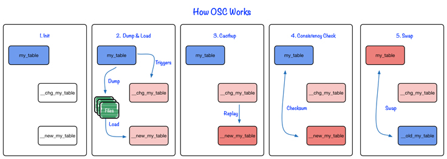

---
tags:
  - MySQL
title: 무중단으로 DB 스키마 수정하기
---

## 배경

- 운영중인 DB에 여러 애플리케이션이 사용하고 있으면 컬럼 수정/삭제가 제한이 된다.

## Online Schema Change

### 정의

- 이름 그대로 운영중인 상태에서 스키마를 변경하는 기법을 말한다.

### 동작 과정

1. 대상 테이블을 복제한다.
2. 복제된 테이블에 스키마를 수정한다.
3. binary log stream이나 trigger 등을 사용해서 복제된 테이블에 변경사항을 반영한다.
4. 수정된 코드를 배포한다.
5. 대상 테이블과 복제된 테이블을 swap한다.

### 주요 툴

- Meta: https://github.com/facebookincubator/OnlineSchemaChange
- gh-ost: https://github.com/github/gh-ost

## 참고 자료

- https://jojoldu.tistory.com/358
- https://blog.myungseokang.dev/posts/online-schema-change/
