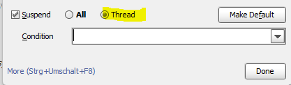

---
tags:
  - IntelliJ
title: 브레이크 포인트 지정시 해당 스레드만 멈추도록 설정하기
---

브레이크 포인트를 찍어두고 h2-console로 DB 상태를 확인해야되는 경우가 있었다. 하지만 브레이크 포인트에서 멈추면 모든 스레드가 멈추어서 h2-console에 접속하지 못하는 상황이 생겼다. 이를 해결하기 위해 해당 브레이크 포인트의 스레드만 멈추가 설정할 수 있다.

브레이크 포인트에 우클릭하면 설정이 가능하다.

## 참고 자료

[https://stackoverflow.com/questions/35179110/spring-boot-is-blocking-h2-console-in-debug-mode](https://stackoverflow.com/questions/35179110/spring-boot-is-blocking-h2-console-in-debug-mode)
