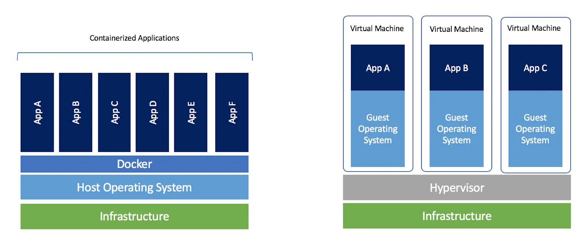
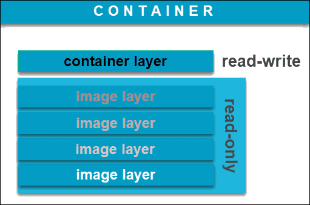
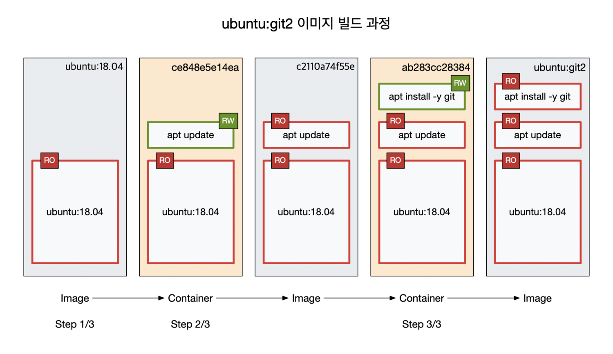
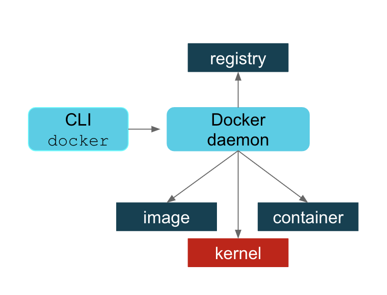
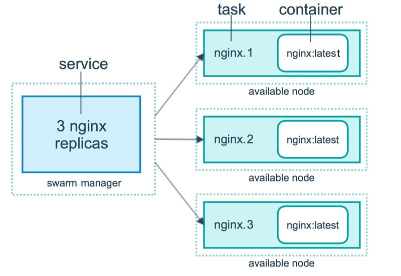
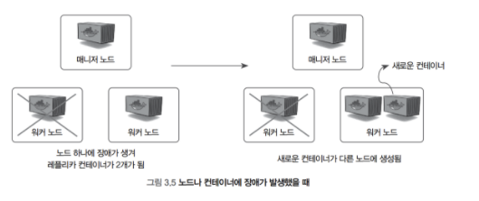

# Docker 이해하기

지금까지 도커를 사용하여 배포 환경을 구축해왔지만 사실 도커에대한 이해가 있는 것은 아니다. 최근에 도커를 건드릴 일이 많아졌기 때문에 이 기회에 도커에대해서 학습해보고자 한다.

## 컨테이너

도커를 사용하면서 가장 많이 언급되는 단어가 컨테이너다. 컨테이너는 하나의 운영 체제 커널에서 다른 프로세스에 영향을 받지않고 독립적으로 실행되는 프로세스의 상태를 말한다. 독립적인 환경을 가지기 때문에 각 컨테이너마다 프로세스 ID도 격리되어 관리된다. 이 컨테이너 덕분에 우리는 배포 환경에 의존적이지 않도록 구성할 수 있다는 장점이 있다.


예전부터 유닉스나 리눅스는 하나의 운영 체제 안에서 자원을 분리해 할당하고, 실행되는 프로세스를 격리하는 방법이 존재했다. 하지만 그 과정이 너무 복잡해서 사용하기 불편했다. 이 복잡한 과정을 쉽게 만들어주는 컨테이너 도구 중에 최근에 가장 많이 사용되는 것이 도커다. 그외에도 Containerd, CRI-O, Podman 등이 있다고 한다. 또한, 다수의 컨테이너를 관리할 때 사용하는 시스템이 쿠버네티스다. 컨테이너의 자동 배포와 부하에 따른 동적 확장 등의 기능을 제공한다.

## 컨테이너 vs 가상 머신

컨테이너가 언급되면 가상 머신과 자주 비교된다. 이 둘은 어떤 차이가 있을까. 가상 머신의 경우는 여러 개의 운영체제를 하나의 호스트에서 생성해 사용하는 방식이다. 각 운영체제를 하나의 가상 머신이라고 구별한다. 가상머신의 경우는 하이퍼바이저에 의해 생성되고 관리된다. 각 가상 머신은 완전히 독립된 시스템 자원을 할당 받아사용하게 된다. 그러나 각 시스템 자원을 가상화하고 독립된 공간을 생성하는 작업은 항상 하이퍼바이저를 거치기 때문에 성능의 손실이 발생한다. 또한 가상 머신은 운영체제를 사용하기 위한 라이브러리, 커널 등을 모두 저장학 ㅣ떄문에 이미지의 크기가 엄청 크다.

이에 반해 컨테이너는 리눅스 자체 기능인 chroot, 네임스페이스, cgroup을 사용함으로써 프로세스 단위의 격리 환경을 만들기 때문에 성능 손실이 거의 없다. 컨테이너에 필요한 커널은 호스트의 커널을 공유해 사용하고, 컨테이너 안에는 애플리케이션을 구동하는 데 필요한 라이브러리 및 실행 파일만 존재하기 때문에 컨테이너의 이미지 용량 또한 가상 머신에비해 가볍다.



## 이미지

도커를 처음 접하게 되면, 이미지와 컨테이너를 헷갈려하는 경우가 많다. 도커 이미지는 컨테이너를 생성할 때 필요한 소스 코드, 라이브러리, 의존성 등을 포함하는 바이너리 파일이다. 이미지 내부에는 여러 레이어로 되어 있고, 컨테이너를 생성하고 실행할 때는 읽기 전용으로 사용된다. 컨테이너는 이미지를 읽기 전용으로 사용하고, 이미지에서 변경된 사항만 컨테이너 계층에 저장하므로 컨테이너에서 무엇을 하든지 이미지 파일에는 영향을 주지 않는다.



도커는 기본적으로 도커 허브(Docker Hub)라는 중앙 이미지 저장소에서 이미지를 내려받는다. 도커 허브는 도커가 공식적으로 제공하는 이미지 저장소로, 도커 게정을 가지고 있으면 누구나 이미지를 올리겨 내려받을 수 있다. 

### 이미지 검색

`docker search` 명령어를 통해 도커 허브의 이미지를 검색할 수도 있다. 아래 사진은 내가 테스트로 올려놓은 mariadb 이미지다.


`docker push`, `docker pull` 명령어를 통해 이미지를 도커 허브로부터 올리고, 내려 받을 수 있다.

### 이미지 생성

컨테이너 안에 작업한 내용으로 이미지를 만들 수 있다. `docker commit` 명령어를 통해 컨테이너의 변경 사항을 이미지로 만들 수 있다.


commit을 하게 되면 어떤 구조로 저장될까? 아래 그림처럼 기존의 이미지 레이어들 위에 변경 사항을 새로운 레이어로 추가하게 된다.



## 도커의 기능

### 도커 볼륨

컨테이너는 이미지에서 변경된 사항만 저장된다. 컨테이너 내부에 저장되고 있는 데이터들은 컨테이너가 삭제되면 같이 삭제되어버리기 때문에 복구할 수 없다는 문제가 있다. 이 데이터를 영속적으로 관리할 수 있게 하는 방법 중 하나가 볼륨을 활용하는 것이다. 도커 볼륨을 활용하는 방법에는 여러 가지가 있다. 호스트와 볼륨을 공유할 수도 있고, 볼륨 컨테이너를 활용할 수도 있으며, 도커가 관리하는 볼륨을 생성할 수도 있다. 아래 명령어 같이 컨테이너를 실행할 때 `-v` 옵션으로 호스트와 볼륨을 공휴할 수 있다.

```bash
sudo docker run -d -v /home/ubuntu/was/was-logs:/was-logs -p 8080:8080 --name was test/app
```

### 도커 네트워크

도커 컨테이너를 생성하면 가상 IP 주소를 할당받는다. 기본적으로 도커는 컨테이너에 172.17.0.X의 IP를 순차적으로 할당한다. 또한 호스트에 veth로 시작하는 가상 네트워크 인터페이스를 생성한다. 아래는 내가 진행중인 프로젝트에 `ifconfig` 를 입력했을 때의 결과다. 여러 개의 veth 인터페이스가 있다는 것을 확인할 수 있다.


위 사진에서 eth0는 공인 IP와 내부 IP가 할당되어 실제로 외부와 통신할 수 있는 호스트의 네트워크 인터페이스다. 또한 각 컨테이너는 자기 자신이 독립적인 하나의 환경이기 때문에 eth0를 따로 가지고 있다. veth와 컨테이너의 eth0가 연결 되어있다. 위 사진에서 docker0라는 브리지가 있는 것을 확인할 수 있다. docker0 브리지는 각 veth 인터페이스와 바인딩돼 호스트의 eth0 인터페이스와 이어주는 역할을 한다. 아래의 그림을 보면 이해가 쉬울 것이다.


### 컨테이너 로깅

디버깅이나 운영적인 목적으로 컨테이너 내부에 어떤 일이 일어나는지 알아야 되는 경우가 있다. 애플리케이션 레벨에서 로그가 기록되도록 별도의 로깅을 남길 수도 있지만, 도커는 컨테이너의 표준 출력과 에러 로그를 별도의 메타데이터 파일로 저장하며 이를 확인하는 명령어를 제공한다. 아래 사진과 같이 `docker logs {컨테이너 ID 또는 이름}`을 입력하면 컨테이너의 표준 출력을 확인할 수 있다.


`/var/lib/docker/containers/${CONTAINER_ID}/${CONTAINER_ID}-json.log`경로에 컨테이너 로그가 JSON 형태로 저장되어 있는 것을 확인할 수 있다.


## 컨테이너 자원 할당 제한

컨테이너를 생성할 때 자원 할당량을 조정하도록 옵션을 입력할 수 있다. 아무런 옵션을 입력하지 않으면 컨테이너는 호스트의 자원을 제한 없이 쓸 수 있게 설정하게된다. 따라서 프로덕션 단계의 컨테이너를 고려한다면 컨테이너의 자원 할당을 제한해 호스트와 다른 컨테이너의 동작을 방해하지 않게 설정해야된다. `run` 명령어에 `--memory` (메모리), `--cpu-shared` (CPU) 등의 옵션을 추가해 자원을 제한할 수 있다.

## 도커 더 잘 사용하기

### Dockerfile

Dockerfile은 이미지를 만들기 쉽게 해주는 텍스트 파일이다. 기존에는 이미지를 만들기위해 수작업으로 컨테이너를 실행한 다음, 필요한 패키지를 설치하고, 커밋하여 이미지를 생성해야됐다. Dockerfile은 이미지를 만들기위해 자주 처리하는 작업들을 명령어로 제공하고 있다. 

```bash
# Dockerfile
FROM ubuntu:18.04
COPY . /app
RUN make /app
CMD python /app/app.py
```

위 코드는 처리 과정을 설명해보면

- `FROM`: ubuntu:18.04 도커 이미지에서 레이어를 생성한다.
- `COPY`: 현재 호스트 디렉토리에 있는 파일들을 컨테이너의 /app 디렉토리에 복사한다.
- `RUN`: 이미지 생성 과정에서 `make /app` 이라는 쉘 명령어를 실행한다.
- `CMD`: 이미지를 컨테이너로 띄울 때 실행되어야 하는 명령어를 지정한다.

Dockerfile을 통해 이미지를 빌드할 때는 아래의 명령어를 사용하면 된다.

```bash
docker build -t myimage:latest .
```

### 도커 컴포즈

도커 컴포즈는 여러 개의 컨테이너를 하나의 프로젝트로 다룰 수 있도록 해준다. 이를 통해 컨테이너를 이용한 서비스 개발과 CI를 가능하게 해준다. Docker Compose는 docker-compose.yml 파일을 작성해서 사용할 수 있다.

```yaml
version: '3.0'
services:
	web:
		image: alicek106/composetest:web
		ports:
				- "80:80"
		links:
				- mysql:db
		command: apachectl -DFOREGROUND
	mysql:
		image: alicek106/composetset:mysql
		command: mysqld
```

docker-compose.yml 파일은 `docker-compose up -d` 명령어로 실행할 수 있다.

### 도커 데몬

도커의 구조는 크게 두 가지로 나뉜다. 하나는 클라이언트로서의 도커, 하나는 서버로서의 도커다. 실제로 도커 컨테이너를 생성하고 실행하며 이미지를 관리하는 주체는 도커 서버이고, dockered 프로세스로서 동작한다. 

여기서 서버로서의 도커를 도커 데몬이라고 부른다. 도커 데몬은 API 입력을 받아 도커 엔진의 기능을 수행한다. 이 API를 사용할 수 있도록 CLI를 제공하는 것이 도커 클라이언트다. 사용자가 docker로 시작하는 명령어를 입력하면 도커 클라이언트를 사용하느 것이며, 도커 클라이언트는 입력된 명령어를 도커 데몬에게 API로서 전달한다.



도커 데몬의 API를 사용할 수 있는 방법을 추가할 수 있다. 일반적으로 도커 데몬은 CLI를 통해 사용할 수 있기 때문에 아래의 명령어가 실행된 것과 같다.

```bash
dockered -H unix:///var/run/docker.sock
```

아래 명령어는 CLI와 모든 네트워크 인터페이스 카드에 할당된 IP 주소와 2375번 포트로 도커 데몬을 제어할 수 있게하는 명령이다.

```bash
dockered -H unix:///var/run/docker.soick -H tcp://0.0.0.0:2375
```


또한 도커 데몬에 보안 적용도 가능하다고 한다.

### 도커 스웜

도커 스웜모드는 여러 대의 서버를 하나의 자원 풀로 만드는 작업을 쉽게 해준다. 여러 대의 도커 서버를 하나의 클러스터로 만들어 컨테이너를 생성하는 여러 기능을 제공한다. 도커 스웜모드는 매니저 노드와 워커 노드로 구성되어 있다. 매니저 노드는 워커 노드를 관리하기위한 도커 서버이고, 매니저 노드는 기본적으로 워커 노트의 역할을 포함하고 있다. 매니저 노드는 1개 이상 포함되어야 된다. 만약 매니저 노드는 데이터 일관성을 위한 투표 등의 이유로 홀수 개로 구성하는 것을 권장한다.



간단하게 컨테이너를 3개의 서버에 배포하는 예시를 들어본다. 아래와 같은 서버들의 IP와 호스트 이름이 있다고 가정한다.

```json
swarm-manager 192.168.0.100
swarm-worker1 192.168.0.101
swarm-worker2 192.168.0.102
```

매니저 역할을 할 서버에서 아래의 명령어를 실행해서 스웜 클러스터를 시작한다. `--advertise-addr` 에는 다른 도커 서버가 매니저 노드에 접근하기 위한 퍼블릭 IP 주소를 입력한다. 실행하면 아래처럼 토큰을 하나 받을 수 있다.

```bash
$ docker swarm init --advertise-addr=192.168.1.100

Swarm initialized: current node (t8uoehrwcnzdf4q0poh6thlt4) is now a manager.

To add a worker to this swarm, run the following command:

    docker swarm join --token SWMTKN-1-4pldr32x98ytmo60lso4jkhj2mg2zrdqxo33b2n8f50oz01pwp-8y4jflppx6eelxs7cn6fgfmd2 192.168.1.101:2377

To add a manager to this swarm, run 'docker swarm join-token manager' and follow the instructions.
```

워커 역할을 서버에서 아래 명령어를 실행해서 스웜 클러스터에 참여시킨다. 이 때, 토큰값을 함께 넘겨준다. 스웜 매니저는 기본적으로 2377번 포트를 사용하며, 노드 사이의 통신은 7946번 포트를 사용한다.

```bash
docker swarm join --token SWMTKN-1-4pldr32x98ytmo60lso4jkhj2mg2zrdqxo33b2n8f50oz01pwp-8y4jflppx6eelxs7cn6fgfmd2 192.168.1.100:2377
```

매니저 노드에서 아래 명령어로 현재 클러스터 상황을 볼 수 잇다.

```bash
$ docker node ls
ID                            HOSTNAME            STATUS              AVAILABILITY        MANAGER STATUS      ENGINE VERSION
t8uoehrwcnzdf4q0poh6thlt4 *   swarm-manager       Ready               Active              Leader              19.03.2
rmsb5mnofkv8czjgjzpcce1gy     swarm-worker1       Ready               Active                                  19.03.2
01bul21qtizrxnawg56zngs4v     swarm-worker2       Ready               Active                                  19.03.2
```

여기서 추가적으로 서비스라는 개념을 이해해야 된다. 서비스는 같은 이미지에서 생성된 컨테이너의 집합이며, 서비스를 제어하면 해당 서비스 내에 컨테이너에 같은 명령이 수행된다. 서비스에 있는 컨테이너를 태스크라고 부른다. 아래 명령어를 통해 서비스를 생성할 수 있다. `--replicas` 옵션을 통해 생성할 컨테이너의 개수를 지정할 수 있다.

```bash
$ docker service create --name myweb \
--replicas 2 \
-p 80:80 \
nginx
```

태스크를 생성할 때는 두 가지 모드가 있다. 위에서 본 것 같이 지정한 개수의 태스크를 생성하는 레플리카 모드와 모든 각 노드에 태스크를 하나씩 할당하는 글로벌 모드가 있다. 만약 태스크 중 하나가 장애가 발생해서 작동을 멈추면 레플리카 수를 충족하지 못한 것으로 판단하여 스웜 매니저는 다른 노드에 새로운 태스크를 생성한다. 하나의 노드에 여러 개의 태스크를 생성하는 것도 가능하다. 또한 태스크의 개수를 노드의 수보다 많게 설정도 가능하다.



## 참고 자료

컨테이너 인프라 환경 구축을 위한 쿠버네티스/도커(조훈, 심근우, 문성주)

시작하세요! 도커/쿠버네티스(용찬호)

[https://azure.microsoft.com/en-us/overview/what-is-a-container/#overview](https://azure.microsoft.com/en-us/overview/what-is-a-container/#overview)

[https://phoenixnap.com/kb/docker-image-vs-container](https://phoenixnap.com/kb/docker-image-vs-container)

[https://medium.com/@xiaopeng163/docker-bridge-networking-deep-dive-3e2e0549e8a0](https://medium.com/@xiaopeng163/docker-bridge-networking-deep-dive-3e2e0549e8a0)

[https://www.44bits.io/ko/post/building-docker-image-basic-commit-diff-and-dockerfile](https://www.44bits.io/ko/post/building-docker-image-basic-commit-diff-and-dockerfile)

[https://www.daleseo.com/dockerfile/](https://www.daleseo.com/dockerfile/)

[https://docs.docker.com/develop/develop-images/dockerfile_best-practices/](https://docs.docker.com/develop/develop-images/dockerfile_best-practices/)

[https://developers.redhat.com/blog/2019/02/21/podman-and-buildah-for-docker-users](https://developers.redhat.com/blog/2019/02/21/podman-and-buildah-for-docker-users)

[https://javacan.tistory.com/entry/docker-start-8-swarm-cluster](https://javacan.tistory.com/entry/docker-start-8-swarm-cluster)

[https://docs.docker.com/engine/swarm/how-swarm-mode-works/services/](https://docs.docker.com/engine/swarm/how-swarm-mode-works/services/)