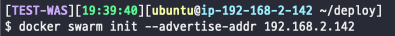
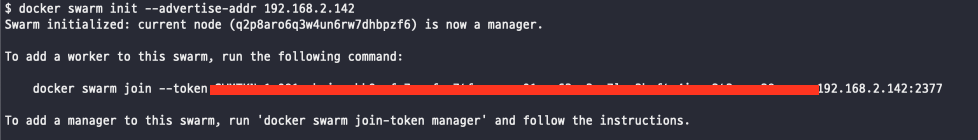
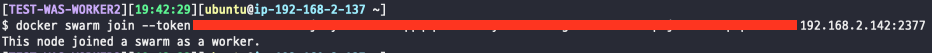
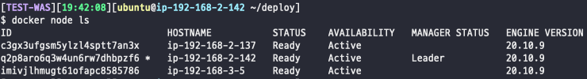

# 도커 스웜을 이용한 스케일 아웃

기존에 내가 진행하던 프로젝트는 WAS가 한 대 뿐이었다. 이번에 성능 향상을 목적으로 스케일 아웃을 진행하기로 결정했다. 스케일 아웃을 진행하면서 처리해야될 작업들에는 다음이 있었다.

1. 서버가 여러 대인 점을 이용한 무중단 배포
2. WAS가 늘어나면서 NGINX에서 요청을 전달한 WAS 선택 방법 (로드 밸런싱)

이를 해결하기 위해서 나는 도커 스웜을 사용해보기로 결정했다. 그 이유는 다음과 같다.

1. 도커 스웜은 자체적으로 롤링 업데이트를 지원하며, 매우 간단하게 사용할 수 있다.
2. ingress 네트워크를 통해 NGINX에 추가적인 설정을 하지않아도, ingress의 로드 밸런서가 라운드 로빈 방식을 사용해서 WAS의 트래픽을 분산시킬 수 있다. 
3. 간단해서 학습하는데 비용이 적게든다.

## 도커 스웜 모드 클러스터 구축

스웜 모드 클러스터 구축 자체는 간단하다.



매니저 노드에서 위와 같은 명령어를 입력하면 스웜 클러스터가 시작된다. `--advertise-addr`는 외부 노드가 매니저 노드에 접근할 때 사용할 수 있는 IP를 지정하는 옵션이다.



실행하면 다음과 같이 토큰 값을 받을 수 있다. 워커 노드로 사용할 서버에 접속하여 다음의 명령어를 입력한다.




다시 매니저로 돌아가서 클러스터의 상태를 보면 워커 노드가 2개 추가된 것을 확인할 수 있다.



## 배포용 이미지 만들기

Dockerfile을 이용하여 이미지를 만들도록 구성할 것이다.

```docker
FROM openjdk:8
COPY babble-0.0.1-SNAPSHOT.jar app.jar
ENTRYPOINT ["java", "-jar", "-Dspring.profiles.active=${PROFILES_ACTIVE}", "-Dspring.datasource.password=${DATASOURCE_PASSWORD}", "-Dspring.redis.password=${REDIS_PASSWORD}", "-Duser.timezone=Asia/Seoul", "app.jar"]
```

환경 변수를 통해 컨테이너를 실행할 때 비밀 번호를 입력받도록 구성할 것이다. 비밀번호는 github secrets를 이용하여 관리한다. 다음과 같은 방법으로 환경 변수를 지정하여 실행할 수 있다.

```bash
$ sudo docker run -it -v /home/ubuntu/deploy/was-logs:/was-logs -p 8080:8080 --name junroot-was -e DATASOURCE_PASSWORD=password -e REDIS_PASSWORD=password test-was/app
```

## 이미지 배포하기

이미지는 Docker hub에 push되어 배포가 진행된다.

```bash
docker push 2021babble/babble-was:latest
```

WAS에서 매니저 노드가 이미지를 pull한 뒤 서비스를 생성한다.

```bash
docker service create \
--name babble-was --replicas=3 \
--mount type=bind,source=/home/ubuntu/was-logs,target=/was-logs \
--publish mode=host,target=8080,published=8080 \
-e PROFILES_ACTIVE=prod -e DATASOURCE_PASSWORD=password -e  -e REDIS_PASSWORD=password \
2021babble/babble-was:latest
```

이후에는 서비스를 새로만들지 않고 pull 한뒤에 서비스 롤링 업데이트를 진행하면된다.

```bash
docker service update --image 2021babble/babble-was:latest babble-was
```

## NGINX 로드 밸런싱

이제 NGINX에서 로드밸런싱이 가능하도록 구성한다. NGINX의 nginx.conf 파일에 upstream을 다음과 같이 명시하면된다.

```bash
upstream app {
  least_conn;
  server 192.168.2.137:8080;
  server 192.168.2.142:8080;
  server 192.168.3.5:8080;
}
```

`least_conn` 은 로드밸린싱 방식을 지정한 것이다. 가장 커넥션 수가 적었던 서버로 요청을 보낸다.

```bash
round-robin(디폴트) - 그냥 돌아가면서 분배한다.
hash - 해시한 값으로 분배한다 쓰려면 hash <키> 형태로 쓴다. ex)hash $remote_addr <- 이는 ip_hash와 같다.
ip_hash - 아이피로 해싱해서 분배한다.
random - 그냥 랜덤으로 분배한다.
least_conn - 연결수가 가장 적은 서버를 선택해서 분배, 근데 가중치를 고려함
least_time - 연결수가 가자 적으면서 평균 응답시간이 가장 적은 쪽을 선택해서분배
```

최종적으로 다음 그림과 같은 인프라를 구성할 수 있었다.


## NFS을 이용한 볼륨 매핑

이렇게 끝내고 싶었지만, 새로운 문제점이 발견되었다. `--mount type=bind,source=/home/ubuntu/was-logs,target=/was-logs` 옵션으로 컨테이너를 실행한다면 각 인스턴스마다 따로 로그 파일이 남게되어서, 로그 파일 집계가 힘들다는 단점이 있다. 로그 파일을 수집하여  Cloudwatch에 뿌려주는 상황이라면 더 골치아프다. 아쉽게도 도커 스웜은 여러 노드에 대한 볼륨 클러스터링은 지원하지 않는다. 따라서, NFS를 이용하여 여러 노드가 파일을 공유하도록 구성할 필요가 있다. 

### NFS 서버 실행

먼저 로그 수집을 위한 별도의 노드를 만들고 거기에 NFS 서버를 실행한다. 아래와 같이 NFS 커널 서버 패키지를 설치한다.

```bash
$ sudo apt update
$ sudo apt install nfs-kernel-server
```

그 다음으로는 서버가 외부에 공개할 디렉토리를 생성한 후, 모든 서버가 이 디렉토리에 접근이 가능하도록 모든 권한을 부여한다.

```bash
$ sudo chown -R nobody:nogroup /mnt/main-was-logs/
$ sudo chmod 777 /mnt/main-was-logs/
```

NFS 서버의 엑세스 권한은 `/etc/exports` 파일에서 설정이 가능하다. 아래와 같이 파일을 연다.

```bash
$ sudo vim /etc/exports
```

위에서 생성한 디렉토리에 `[192.168.xxx.xxx](http://192.168.xxx.xxx)` IP가 접근할 수 있도록 서브넷을 명시한다.

```bash
/mnt/main-was-logs 192.168.0.0/16(rw,sync,no_subtree_check)
```

변경 사항을 적용하고 NFS 서버를 재시작하면 성공적으로 NFS 서버가 실행된다.

```bash
$ sudo exportfs -a
$ sudo systemctl restart nfs-kernel-server
```

### 클라이언트 서버 실행

클라이언트 서버에는 `nfs-common` 패키지만 설치하면된다.

```bash
$ sudo apt install nfs-common
```

### 서비스 실행

```bash
docker service create \
  --name babble-was --replicas=3 \
  --mount type=volume,source=nfsvolume,target=/was-logs,volume-driver=local,volume-opt=type=nfs,volume-opt=device=:/mnt/main-was-logs,volume-opt=o=addr=192.168.1.20 \
  --publish mode=host,target=8080,published=8080 \
  -e PROFILES_ACTIVE=prod -e DATASOURCE_PASSWORD=password -e REDIS_PASSWORD=password \
  2021babble/babble-was:latest
```

위 명령어와 같이 마운트 옵션을 주면 서비스를 실행할 때 지정된 NFS에 볼륨이 매핑된다. 이 때 주의할 점이 있다. 위 명령어로 생성된 도커 볼륨은 서비스를 종료시켜도 남아 있으니 `docker volume rm <volume id>` 로 볼륨을 지우고 진행해야된다. 마스터 노드 뿐만 아니라 워커 노드에도 볼륨을 지우는 작업이 필요하다.

## 참고 자료

시작하세요! 도커/쿠버네티스(용찬호)

[https://kamang-it.tistory.com/entry/WebServernginxnginx로-로드밸런싱-하기](https://kamang-it.tistory.com/entry/WebServernginxnginx%EB%A1%9C-%EB%A1%9C%EB%93%9C%EB%B0%B8%EB%9F%B0%EC%8B%B1-%ED%95%98%EA%B8%B0)

[https://docs.nginx.com/nginx/admin-guide/load-balancer/http-load-balancer/](https://docs.nginx.com/nginx/admin-guide/load-balancer/http-load-balancer/)

[https://www.tecmint.com/install-nfs-server-on-ubuntu/](https://www.tecmint.com/install-nfs-server-on-ubuntu/)