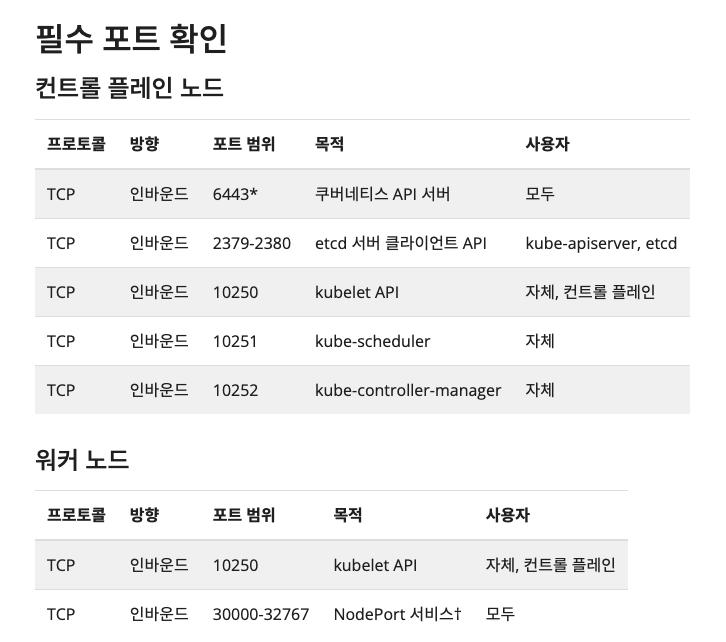

# 쿠버네티스로 클러스터 구성하기

## 쿠버네티스 구성 방법

### 퍼블릭 클라우드 업체에서 제공하는 관리형 쿠버네티스

EKS(Amazon Elastic Kubernetes), AKS(Azure Kubernetes Services), GKE(Google Kubernetes Engine) 등이 있다. 구성이 이미 다 갖춰져 있고 마스터 노드를 클라우드 업체에서 관리하기 떄문에 학습용으로는 적합하지 않다.

### 설치형 쿠버네티스

Rancher, OpenShift 등이 있다. 하지만 유료라는 단점이 있다.

### 구성형 쿠버네티스

kubeadm, kops(Kubernetes Operations), KRIB(Kubernetes Rebar Integrated Bootstrap), kubespray 등이 있다. 사용하는 시스템에 쿠버네티스 클러스터를 자동으로 구성해준다. kubeadm이 가장 널리 알려져 있다. kubeadm은 사용자가 변경하기도 쉽고, 온프레미스와 클라우드를 모두 지원하며, 배우기도 쉽다.

## kubeadm으로 클러스터 구성하기

### kubeadm 설치하기

마스터 노드와 워커 노드 모두 설치해야된다. 설치 전에 사용하고 있는 노드들이 다음의 포트가 열려있는지 확인해야된다. 또한, 모든 노드가 당연히 Docker가 설치되어 있어야한다.



1. `apt` 패키지 색인을 업데이트하고, 쿠버네티스 `apt` 리포지터리를 사용하는 데 필요한 패키지를 설치한다.
   
    ```bash
    sudo apt-get update
    sudo apt-get install -y apt-transport-https ca-certificates curl
    ```
    
2. 구글 클라우드의 공개 사이닝 키를 다운로드 한다.
   
    ```bash
    sudo curl -fsSLo /usr/share/keyrings/kubernetes-archive-keyring.gpg https://packages.cloud.google.com/apt/doc/apt-key.gpg
    ```
    
3. 쿠버네티스 `apt` 리포지터리를 추가한다.
   
    ```bash
    echo "deb [signed-by=/usr/share/keyrings/kubernetes-archive-keyring.gpg] https://apt.kubernetes.io/ kubernetes-xenial main" | sudo tee /etc/apt/sources.list.d/kubernetes.list
    ```
    
4. `apt` 패키지 색인을 업데이트하고, kubelet, kubeadm, kubectl을 설치하고 해당 버전을 고정한다.
   
    ```bash
    sudo apt-get update
    sudo apt-get install -y kubelet kubeadm kubectl
    sudo apt-mark hold kubelet kubeadm kubectl
    ```
    

### 마스터 노드에서 클러스터 초기화

마스터 노드로 사용할 호스트에서 다음 명령어를 입력하면 된다.

```bash
sudo kubeadm init --apiserver-advertise-address 192.168.3.11 --pod-network-cidr=172.168.0.0/16
```

- `--apiserver-advertise-address`: 다른 노드가 마스터 노드에 접근할 수 있는 IP 주소를 기입한다.
- `--pod-network-cidr`: 쿠버니테스에서 사용할 컨테이너의 네트워크 대역을 설정한다. 서버의 네트워크 대역과 중복되지 않게 선택해야된다.

명령어를 입력하면 다음과 같은 결과가 나온다. 위의 명령어 3줄은 마스터 노드에 실행하면 된다.

```bash
Your Kubernetes control-plane has initialized successfully!

To start using your cluster, you need to run the following as a regular user:

  mkdir -p $HOME/.kube
  sudo cp -i /etc/kubernetes/admin.conf $HOME/.kube/config
  sudo chown $(id -u):$(id -g) $HOME/.kube/config

Alternatively, if you are the root user, you can run:

  export KUBECONFIG=/etc/kubernetes/admin.conf

You should now deploy a pod network to the cluster.
Run "kubectl apply -f [podnetwork].yaml" with one of the options listed at:
  https://kubernetes.io/docs/concepts/cluster-administration/addons/

Then you can join any number of worker nodes by running the following on each as root:

kubeadm join 192.168.3.11:6443 --token sxezkh.29vpxqiraqle5u5x \
	--discovery-token-ca-cert-hash sha256:9ac31c31d115108cc6b39d45eb52d7f2ab650b9632428814cb82857b4b93938a
```

### 워커 노드 클러스터 참여

워커 노드에서는 마스터 노드에서 발급 받은 토큰으로 클러스터에 참여하면 된다.

```bash
kubeadm join 192.168.3.11:6443 --token sxezkh.29vpxqiraqle5u5x \
	--discovery-token-ca-cert-hash sha256:9ac31c31d115108cc6b39d45eb52d7f2ab650b9632428814cb82857b4b93938a
```

## 트러블 슈팅

### cgroup 관련 문제


다음과 같은 에러가 발생하는 경우가 있다. `journalctl -xeu kubelet`를 호출해서 확인해보면 다음과 같은 로그가 있다. kubelet과 docker가 다른 cgroup을 사용해서 발생하는 문제다.

```bash
"Failed to run kubelet" err="failed to run Kubelet: misconfiguration: kubelet cgroup driver: \"systemd\" is different from docker cgroup driver: \"cgroupfs\""
```

`/etc/docker/daemon.json` 경로에 다음과 같이 파일을 추가했다.

```bash
{
  "exec-opts": ["native.cgroupdriver=systemd"]
}
```

저장한뒤 docker service를 재실행하면 된다.

```bash
sudo systemctl restart docker
```

## 결과 확인


다음과 같이 결과가 나온 것을 확인할 수 있다. 마스터 노드 하나와 워커 노드 2개를 구축해놓은 상태이다.

## 참고 자료

[https://stackoverflow.com/questions/43794169/docker-change-cgroup-driver-to-systemd](https://stackoverflow.com/questions/43794169/docker-change-cgroup-driver-to-systemd)

[https://stackoverflow.com/questions/45708175/kubelet-failed-with-kubelet-cgroup-driver-cgroupfs-is-different-from-docker-c](https://stackoverflow.com/questions/45708175/kubelet-failed-with-kubelet-cgroup-driver-cgroupfs-is-different-from-docker-c)

[https://kubernetes.io/ko/docs/setup/production-environment/tools/_print/#pg-29e59491dd6118b23072dfe9ebb93323](https://kubernetes.io/ko/docs/setup/production-environment/tools/_print/#pg-29e59491dd6118b23072dfe9ebb93323)

[https://kubernetes.io/docs/setup/production-environment/tools/kubeadm/create-cluster-kubeadm/](https://kubernetes.io/docs/setup/production-environment/tools/kubeadm/create-cluster-kubeadm/)