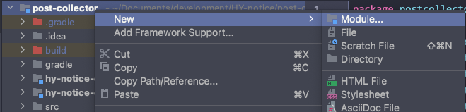

# Gradle로 멀티 모듈 환경 구성하기

토이 프로젝트를 진행하면서 크롤링 애플리케이션, 조회 애플리케이션을 나누어서 개발하는 상황이 필요했다. 이 때, 두 애플리케이션에서 공통으로 사용되는 엔티티들이 일부 존재했다. 두 애플리케이션에서 공통으로 사용되는 엔티티의 코드를 복사, 붙여넣기로 구현할 수도 있지만 이럴 경우 엔티티의 수정이 있을 때 두 코드에 매번 똑같이 적용해야 되기 때문에 불편함이 있었다. 이를 해결하기 위해 멀티 모듈을 사용해보기로 했다.

## 구성


- hy-notice-core: 두 애플리케이션에서 공통적으로 사용되는 엔티티들을 담고있는 모듈
- hy-notice-client: 크롤링에 필요한 로직을 구현 해놓은 모듈
- hy-notice-api: 크롤링한 데이터를 조회하기 위해 필요한 api들을 구현 해놓은 모듈

## 방법

### 1. 서브 모듈 만들기

intelliJ를 사용해서 서브모듈을 만든다. 그리고 기존에 구현해놓은 코드들을 각 모듈에 맞게 분리해서 옮겨담았다.



### 2. settings.gradle 파일 수정

Gradle 빌드 시에 각 서브 모듈들을 프로젝트에 포함시키기 위해서 `settings.gradle` 파일을 수정해야된다. 아래와 같이 서브 모듈의 이름은 include 문으로 포함시키면 된다.

```groovy
rootProject.name = 'post-collector'
include 'hy-notice-core'
include 'hy-notice-client'
```

### 3. hy-notice-core 프로젝트 설정

hy-notice-core 서브 모듈 내부에 `build.gradle` 파일이 있을 것이다. 해당 서브 모듈 내에서 필요한 설정들을 하면된다.

```groovy
plugins {
    id 'java'
}

group 'kr.junroot'
version '1.0-SNAPSHOT'

repositories {
    mavenCentral()
}

test {
    useJUnitPlatform()
}
```

### 4. hy-notice-client 프로젝트 설정

hy-notice-client 서브 모듈 내부에도 `build.gradle` 파일이 있다. 똑같이 필요한 설정을 해주면 되는데, 해당 서브 모듈은 hy-notice-core 모듈을 사용하고 있기 때문에 의존에 추가해야된다.

```groovy
plugins {
    id 'java'
}

group 'kr.junroot'
version '1.0-SNAPSHOT'

repositories {
    mavenCentral()
}

dependencies {
    implementation 'org.jsoup:jsoup:1.14.3'
    implementation project(':hy-notice-core')

    testImplementation 'org.mockito:mockito-inline:4.2.0'
}

test {
    useJUnitPlatform()
}
```

이 때, `complie project(':hy-notice-core')` 와 같은 형식으로 의존을 추가하고 `Could not find method compile() for arguments` 같은 빌드 실패를 겪을 수도 있는데, Gradle 3.0부터 `compile` 대신 `implementation`과 `api`를 사용하고 있으니 참고하길 바란다.

### 5. 중복 설정 제거

`build.gradle` 을 작성하다보면, 모든 모듈에서 공통적으로 발생하는 설정이 존재할 수 밖에 없다. 나같은 경우는 lombok, spring data jpa, junit 의존들이 모든 모듈에서 공통적으로 사용하고 있다. 이 중복 설정을 제거하기 위해서 루트 디렉터리에 있는 `build.gradle` 을 수정해야된다.

아래와 같이 `subprojects` 내부에 공통적으로 설정하게되는 플러그인, 그룹, 버전, 저장소, 의존 등을 설정할 수 있다.

```groovy
subprojects {
    apply plugin: 'java'

    group 'kr.junroot'
    version '1.0-SNAPSHOT'

    repositories {
        mavenCentral()
    }

    dependencies {
        compileOnly 'org.projectlombok:lombok:1.18.22'
        annotationProcessor 'org.projectlombok:lombok:1.18.22'
        testCompileOnly 'org.projectlombok:lombok:1.18.22'
        testAnnotationProcessor 'org.projectlombok:lombok:1.18.22'

        implementation 'org.springframework.boot:spring-boot-starter-data-jpa:2.6.2'
        implementation 'org.mariadb.jdbc:mariadb-java-client:2.7.4'

        testImplementation 'org.junit.jupiter:junit-jupiter-api:5.8.2'
        testImplementation 'org.assertj:assertj-core:3.22.0'
        testRuntimeOnly 'org.junit.jupiter:junit-jupiter-engine:5.8.2'
    }

    test {
        useJUnitPlatform()
    }
}
```

## 참고 자료

[https://www.petrikainulainen.net/programming/gradle/getting-started-with-gradle-creating-a-multi-project-build/](https://www.petrikainulainen.net/programming/gradle/getting-started-with-gradle-creating-a-multi-project-build/)

[https://devdavelee.tistory.com/29](https://devdavelee.tistory.com/29)