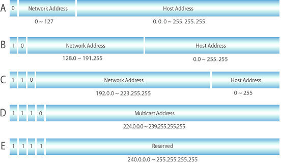

---
tags:
  - 테스트
title: 성능 테스트
---

팀 프로젝트에 성능 테스트를 진행해보기 앞서 성능 테스트의 기본 지식을 학습할 필요가 있어서 글을 작성하게 되었다. 

## 성능 테스트? 부하 테스트? 스트레스 테스트?

성능 테스트, 부하 테스트, 스트레스 테스트. 이름만 들어서는 전부 같은 같은 말로 보였다. 하지만 실제로 표현하는 사례들을 보니 어느 정도 차이가 있었다. 

### 성능 테스트

성능 테스트는 소프트웨어와 인프라의 속도를 테스트한다. 메모리 사용량, 네트워크 대역폭 및 처리량, 응답 시간, CPU 사용률 등의 기준을 두고 측정할 수 있다. 시스템 내에 통신 과정의 병목을 찾아내기 위해서 진행 한다.

### 부하 테스트

부하 테스트는 성능 테스트의 일부다. 특정 기간 동안 동시에 많은 트랜잭션을 발생시켜 응답 시간을 확인하고 병목 지점을 찾는다. 또한 현재 애플리케이션이 처리할 수 있는 사용자의 수도 확인할 수 있다.

### 스트레스 테스트

스트레스 테스트는 현재 시스템이 처리할 수 있는 부하보다 높은 트래픽을 발생시켰을 때 시스템이 어떻게 동작하는지 확인하는 테스트다. 시스템이 과부하 상태에서 정상 상태로 돌아갈 때 어떻게 정상적으로 복구하는지 확인한다.

이외에도 성능 테스트를 하는 여러가지 방법이 많다고 한다.

## 흔히 발생하는 성능 문제

### 긴 로드 시간 및 응답 시간

로드 시간과 응답 시간의 차이점을 이해하지 못할 수도 있다. 응답 시간은 사용자가 요청을 보냈을 때, 서버로 응답을 받기까지의 시간이다. 로드 시간은 사용자가 URL을 통해 요청을 보낸 후 전체 페이지를 랜더링하기까지 발생하는 시간이다. 응답 시간이 로드 시간에 영향을 줄 수 있다고 생각할 수 있다. 이를 해결하기 위해서

1. 이미지 크기 및 형식 최적화
2. 클라이언트 캐싱 및 CDN 적용
3. DB 쿼리 최적화 및 캐싱
4. 자바스크립트 비동기식으로 처리
5. gzip 적용
6. HTTP/2 도입

등의 방법이 있다.

### 낮은 확장성

시스템이 예상한 사용자 수만큼의 처리를 동시에 처리할 수 없는 경우를 확장성이 낮다고 표현한다. 확장성을 확인하기 위해 주로 부하 테스트를 진행한다. 이를 해결하기 위해서는 하드웨어 리소스를 확장시키면된다. 확장 시키는 방법으로는 2가지가 있다.

- Vertical Scailing

단일 컴퓨터에 하드웨어 리소스를 추가하는 방법이다. 이 방법은 애플리케이션의 코드 부분에는 변경할 내용이 없기 때문에 단순하다는 장점이 있다. 하지만 단일 컴퓨터에 리소스를 추가하는 것에는 한계가 있기 때문에 Vertical Scailing을 통해서만 해결할 수 없다.

- Horizontal Scailing

병렬적으로 동작할 수 있는 컴퓨터를 추가하는 방법이다. 이를 구현하려면 로드 밸런서 같은 트래픽을 분산 시켜주는 추가적인 기술이 필요하다. 하지만 하드웨어 의존적이지 않고, 이론적으로 무한한 확장이 가능하다는 장점이 있다.

### 병목 현상

CPU, 메모리, 디스크, 네트워크 사용량 등의 병목 현상으로인해 응답 속도가 느리거나 처리량을 낮아지는 문제가 있을 수 있다. 일반적으로 이를 해결하기 위해서, 병목 현상을 일으키는 소스 코드를 수정 하거나 하드웨어를 업그레이드해서 해결할 수 있다.

## 참고 자료

[https://www.blazemeter.com/blog/performance-testing-vs-load-testing-vs-stress-testing](https://www.blazemeter.com/blog/performance-testing-vs-load-testing-vs-stress-testing)

[https://searchsoftwarequality.techtarget.com/definition/performance-testing](https://searchsoftwarequality.techtarget.com/definition/performance-testing)

[https://www.woorank.com/en/edu/seo-guides/page-load-time](https://www.woorank.com/en/edu/seo-guides/page-load-time)

[https://www.pingdom.com/blog/page-load-time-vs-response-time-what-is-the-difference/](https://www.pingdom.com/blog/page-load-time-vs-response-time-what-is-the-difference/)

[https://www.romexsoft.com/blog/improve-scalability/](https://www.romexsoft.com/blog/improve-scalability/)

[https://www.haedongg.net/?p=179](https://www.haedongg.net/?p=179)

[https://www.guru99.com/performance-testing.html#4](https://www.guru99.com/performance-testing.html#4)
