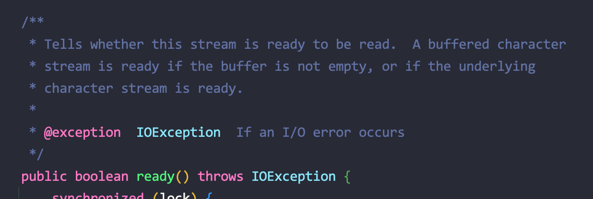

---
tags:
  - Java
---
# 소켓 통신 시 BufferdReader가 입력을 기다리지 않는 문제

## 기존 코드

```java
while (bufferedReader.ready()) {
		...
}
```

이렇게 구현하니 클라이언트가 데이터를 보내기전에 여기에오면 그냥 통과해버리는 문제가 있었다. 



## 현재 코드

```java
while (Objects.nonNull(line = bufferedReader.readLine())) {
    ...
}
```

어차피 `readLine()` 메소드는 다음 입력이 오기전까지 대기하기 때문에 `ready()` 없이 해결할 수 있었다.

## 참고 자료

[https://stackoverflow.com/questions/19353133/block-bufferedreader-until-data-appears](https://stackoverflow.com/questions/19353133/block-bufferedreader-until-data-appears)