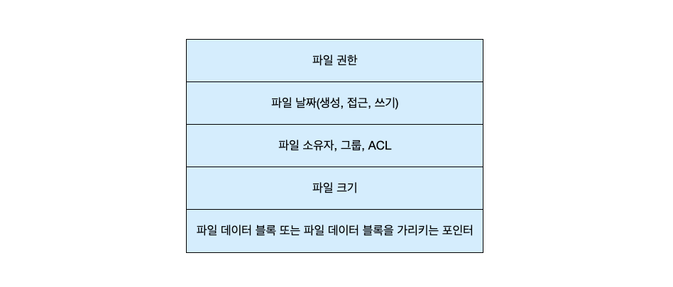

---
tags:
  - 도서/운영체제-(공룡책)
title: 운영체제 (공룡책)
---

## 파일 시스템 인터페이스

### 파일 개념

- 파일: 컴퓨터를 편리하게 사용하기 위해 저장된 정보에 대한 논리적인 단위.
- 일반적으로 파일은 프로그램 또는 자료를 나타낸다.
- 자료는 숫자, 문자, 이진수 등으로 구성될 수 있고, 자유로운 형식이 될 수도 있고, 엄격한 형식을 갖출수도 있다.
- 프로그램은 소스 파일과 실행 파일을 나타낸다.

### 파일 속성

- 이름: 기호형 파일의 이름은 사람이 읽을 수 있는형태로 유지된 유일한 정보이다.
- 식별자(identifier): 이 고유의 꼬리표는 통상 하나의 숫자로 파일 시스템 내에서 파일을 확인한다. 식별자는 우리가 읽을 수 없는 파일의 이름이다.
- 유형: 이 정보는 여러 유형을 제공하는 시스템을위해 필요하다.
- 위치: 이 정보는 파일이 존재하는 장치와 그장치 내의 위치에 대한 포인터다.
- 크기: 파일의 현재크기(바이트, 워드 혹은 블록들로 나타낸다)와 최대 허용 가능한 크기가 이 속성에 포함된다.
- 보호: 접근 제어 정보는 누가 읽기, 쓰기, 실행 등을 할 수 있는가를 제어한다.
- 타임스탬프와 사용자 식별: 이 정보는 생성, 최근 변경, 최근 사용 등을 유지하고, 이들 자료는 보호, 보안 및 사용자 감시를 위해 사용된다.

### 파일 연산

- 파일 생성: 파일을 생성하기 위해서는 2단계가 필요하다.
    1. 파일을 저장할 수 있도록 파일 시스템 내에서 공간을 찾는다.
    2. 새로 생성된 파일에 대한 항목이 디렉터리에 만들어져야 한다.
- 파일 열기: 이름을 검사하고, 접근 권한을 확인하는 등의 작업을 수행한다. 따라서 파일 생성과 삭제를 제외한 모든 연산을 하기전에 수행한다.
- 파일 쓰기: 파일 내의 다음 순차적 쓰기가 일어날 위치를 가리키는 쓰기 포인터를 유지한다.
- 파일 읽기: 읽기 포인터를 유지한다. 일반적으로 파일 읽기나 파일 쓰기 중 하나를 하고 있기 때문에, 대부분의 시스템은 하나의 현재 파일 위치 포인터를 가진다.
- 파일 안에서 위치 재설정
- 파일 삭제: 다른 파일에서 재사용할 수 있도록 모든 파일 공간을 해제하고 디렉토리항목을 지우거나 사용 가능으로 표시한다. 일부 시스템에서는 동일한 파일에 대해 여러 개의 이름을 존해라 수 있는 하드 링크를 허용한다. 하드 링크의 경우는 마지막 링크가 삭제될 때까지 삭제하지 않는다.
- 파일 절단: 파일의 내용은 지우고 파일의 속성은 그대로 남기기를 원할 때 사용한다. 파일의 길이를 제외한 모든 속성은 그대로 유지하게 된다.

보통 운영체제는 두 단계 내부 테이블, 즉 프로세스 별 테이블과 범시스템 테이블을 사용한다. 프로세스별 테이블은 각 프로세스가 연 모든 파일을 기록한다. 열린 파일과 관련된 몇 가지 정보들을 요약하면 다음과 같다.

- 파일 포인터: 현재 파일 위치 포인터로써 가장 최근의 읽기/쓰기 위치를 추적한다.
- 파일 열린 계수: 여러 프로세스가 파일을 열 수 있기 때문에, 시스템은 열린 파일 테이블 항목을 제거하기 전에 마지막 파일이 닫히기까지 기다려야하기 때문에 열린 수을 추적한다.
- 파일의 위치: 파일의 위치를 찾기 위한 정보는 연산마다 디렉터리 구조에서 읽는 것을 피하고자 메모리에 저장된다.
- 접근 권한: 각 각 프로세스는 한 파일을 하나의 접근 모드로 연다. 이 정보는 프로세스 별 테이블에 저장되며 운영체제는 이 정보를 허용하거나 불허하는데 사용한다.

몇몇 운영체제는 열린 파일을 락킹할 수 있는 기능을 제공한다. 공유락은 여러 프로세스가 동시에 락을 획득할 수 있다는 점에서 읽기락과 비슷하다. 배타적인 락(exclusive lock)은 한 번에 한 프로세스만 락을 획득할 수 있다는 점에서 쓰기 락과 비슷하게 행동한다. 강제적 파일 락 방법을 제공하는 운영체제의 경우 배타적인 락을 제공하고 권고적 파일 락 방법을 제공하는 운영체제의 경우 공유 락을 제공한다.

### 파일 유형

시스템은 파일 유형에 따라 파일 연산 명령을 결정한다. 파일 유형을 구분하는 가장 잘 알려진 방법은 확장자를 이용하는 것이다. .com, .exe, .sh 확장자를 가진 파일들은 실행가능하다. .com, .exe 파일은 이진 형태의 파일이지만, .sh 파일은 운영체제에 전될되는 명령을 ASCII 형식으로 저장한다. 하지만 이들은 운영체제가 지원한 것은 아니기 때문에, 응용 프로그램이 동작하는 파일들에 대한 "힌트"로 생각될 수 있다.

macOS에서는 자신을 생성한 프로그램의 이름을 파일의 속성으로 설정되고, UNIX 시스템의 일부 이진 파일의 시작 부분에 매직넘버를 저장하여 파일 유형을 나타낸다.

### 파일 구조

운영체제는 어떤 파일 유형의 구조로 미리 인식할 수 있어야 되는 경우가 있다. 하지만 지원되는 파일의 수가 많아질 수록 운영체제의 크기가 커진다. 그렇다 하더라도 모든 운영체제는 반드시 프로그램을 로딩하고 실행할 수 있는 실행 파일의 구조를 알아야한다.

### 파일의 내부 구조

- 디스크 시스템은 보통 섹터의 크기에 의해 결정되는 블록 크기를 가진다.
- 논리 레코드의 길이는 매우 다양하며 여러 논리 레코드를 하나의 물리 레코드에 팩킹하는 것이 일반적이다.
- 논리 레코드의 크기, 물리 블록 크기 그리고 팩킹 기술은 각 물리 블록 내에 몇개의 논리 블록이 들어갈지 결정한다.
- UNIX의 논리 레코드의 크기는 1 바이트가 된다.
- 디스크 공간은 항상 물리 블록 단위로 할당되기 때문에 마지막 블록의 일부는 낭비된다. 예를들어, 한 물리 블록이 512바이트라면 파일의 크기가 1949바이트일 경우 4 블록이 할당되고 99바이트는 낭비될 것이다. 이를 내부 단편화라고 한다. 모든 파일 시스템은 내부 단편화의 문제를 갖고 있다.

### 접근 방법

운영체제는 다양한 접근 방법을 지원하며 특정 응용 프로그램에 적합한 것을 선택하도록 설계한다.

- 순차 접근: 파일의 레코드를 디스크에 순서대로 저장해두고 차례대로 읽는다. 편집기나 컴파일러는 보통 이러한 형식으로 파일에 접근한다.
- 직접 접근: 대규모 정보를 다루는데 유용하다. 사용자가 사용하는 블록 번호는 상대 블록 번호이고 상대적 블록 번호에대한 실제 블록 번호를 계산하여 접근하도록한다.
- 색인 접근: 블록의 일부를 인덱스로 사용하고, 인덱스를 따로 저장해둔다. 인덱스를 이진 탐색하여 해당 인덱스의 블록의 위치를 찾아 탐색할 수있게 해준다.

### 디렉터리 구조

- 1단계 디렉터리: 모든 파일이 한 개의 디렉터리 밑에 있다. 파일이 많아지거나 다수의 사용자가 사용하면 이용에 제약이 생긴다.
- 2단계 디렉터리: 마스터 파일 디렉터리(MFD)에 각 사용자 디렉터리(UFD)를 가진다. 사용자는 UFD 디렉터리 아래에 파일을 생성할 수 있다. 사용자를 추가/삭제 하기 위해서는 시스템 관리자가 필요하다. 2단계 디렉터리는 두 사용자가 한 파일을 공유해야될 때 문제가 발생한다. 한 사용자가 다른 사용자의 디렉터리에 파일을 공유한다면 경로명에 사용자 이름을 명시해야된다. 또는 먼저 현재 UFD에 서 파일을 찾고 없으면 특수한 사용자 디렉터리를 탐색하도록하는 탐색 경로를 지저할 수도 있다.
- 트리 구조 디렉터리: 루트 디렉터리가 있고 디렉터리 내에 다시 디렉터리나 파일을 가질 수 있다. 통상적으로 각 프로세스는 현재 디렉터리를 가지고있다. 이로인해 경로명에 절대 경로명, 상대 경로명이 생긴다. 트리 구조는 디렉터리의 삭제 문제가 있다. 제거 대상 디렉터리에 파일이나 서브 디렉터리가 남아 있을 경우이다. 해결 방법으로는 1. 비어있지 않으면 삭제를 막는다. 2. 재귀적으로 적용되어 서브 데릭터리의 파일까지 모두 삭제시킨다.
- 비순환 그래프 디렉터리: 디렉터리들이 서브디렉터리들과 파일들을 공유할 수 있도록 허용해주는 구조다. 공유 파일(공유 디렉터리)를 구현하는 방법으로 링크를 사용한다. 링크는 새로운 디렉터리 항목을 만드는 것으로 파일이나 서브디렉터리를 가리키는 포인터다. 운영체제가 디렉터리 트리를 순회활 때는 시스템의 비순환 구조를 유지하기 위해 이들 링크를 무시한다. 링크에는 심볼릭 링크와 하드 링크 2가지가 있다.
    - 심볼릭 링크: 심볼릭 링크는 원본 가리키는 파일이 지워지면 이 링크는 그대로 남겨지고 존재하지 않는 파일의 이름을 가리키는 링크가 된다. 링크가 가리키는 파일이 존재하지 않는 것을 알게되면 접근에 실패하게 된다.
    - 하드 링크: 링크가 파일의 i-node를 가리킨다. 모든 참조가 지워질 때까지 원본 파일을 보존한다. 원본 파일을 가리키는 링크의 개수가 0개면 파일을 삭제하게 된다.
- 일반 그래프 디렉터리: 트리 구조에 링크를 첨가시켜 순환을 허용한다. 하지만 디렉터리에서 순환이 허용될 경우 성능적인 이슈와 잘못 설계된 알고리즘으로 무한루프로 검색을 진행하게된다. 파일 삭제의 경우에도 아무도 참조하지 않고 있어도 참조 개수가 0인 상황이 발생 할 수 있다. 이를 해결하기위해 가비지 수집 기법을 사용하기도 한다.

### 보호

- 접근 유형: 파일을 보호할 때 접근 유형에 따라 제한한다.
    - 읽기: 파일로부터 읽기
    - 쓰기: 파일에 쓰기
    - 실행: 파일을 메모리에 읽어오고 실행하기
    - 추가: 파일의 끝에 새로운 정보를 첨부하기
    - 삭제: 파일을 지우고 사용자 공간을 반납하기
    - 리스트: 파일의 속성, 이름 등을 출력하기
    - 속성 변경: 파일의 속성 변경하기
- 접근 제어: 사용자마다 특정 파일에 대한 접근 허용 여부를 결정하도록 한다. 관리 방법은 아래와 같은 방법들이 있다.
    - ACL: 접근 제어 리스트. 해당 파일을 누가 어떤 연산을 할 수 있는지 리스트로 나열한다. 이는 고정 크기였던 디렉터리 항목이 가변 크기가 되어버려 공간 관리가 복잡해진다는 단점이 있다.
    - 접근 권한 비트: 접근 리스트의 길이를 간결하게 하기 위하여 많은 시스템은 모든 사용자를 소유자, 그룹, 기타로 분류한다.
    - ACL과 접근 권한 비트를 둘 다 사용하는 운영체제도 있다. 이 경우 서로 상충할 때 어떤 것을 적용할 지에대한 설계를 해야된다.
    - 파일 보호를 위해 암호를 요구하는 방법도 있다. 하지만 이는 파일마다 암호를 모두 기억해야 되거나 모든 파일에 대해 하나의 암호를 쓸 경우에는 하나만 알려짐면 모든 파일 접근이 가능하다는 문제가 있다.
    - 여러 단계의 디렉터리를 가지는 구조에는파일 뿐만아니라 디렉터리도 보호된다. 디렉터리 내에 파일을 생성하거나 제거를 할때는 디렉터리의 쓰기권한이 있어야되고, 특정 경로의 파일을 열때는 실행 권한이 필요하다. 디랙터리 내의 파일의 존재 여부를 확인할 때는 디렉터리의 읽기 권한이 필요하다.

### 메모리 사상 파일

- 메모리 사상(memory-mapping)은 프로세스의 가상 주소 공간 중 일부를 관련된 파일에 할애하는 것이다. 이는 현저하게 성능을 향상 시킨다.
- 메모리에 매핑된 파일에 대한 쓰기가 반드시 보조저장장치의 파일에 즉각적으로 써지지 않는다는 것에 주의해야된다. 일반적으로 파일을 닫을 때만 메모리의 변경 사항을 스토리지에 반영한다.
- 일부 운영체제는 파일 관련 시스템 콜을 통해서만 메모리 사상을 지원하지만, 일부는 별도의 표준 시스템콜로 메모리 사상을 지원해준다. (mmap)
- 여러 프로세스가 데이터 공유를 위해 메모리 상에서 파일을 공유하는 경우도 있다. 파일을 공유하는 프로세스들의 page mapping table은 모두 그 파일에 대응하는 물리 메모리상의 페이지를 가리킨다. 한 개의 페이지를 공유하다가, 어떤 프로세스가 그것을 수정하기 시작하면 그 시점에 그 프로세스를 위한 별도의 페이지 복사본을 만들 수도 있다. 페이지 수정 작업이 프로세스 간에 동기화되어야한다면 상호 배제 기법을 사용하면 된3다.

## 파일 시스템 구현

파일 시스템은 데이터와 프로그램을 포함하여 파일 내용의 접근과 저장을 위한 기법을 제공한다. 보통 파일 시스템은 많은 양의 자료를 보관하도록 설계된 보조저장장치에 영구적으로 상주한다. 범용 운영체제는 여러 파일 시스템을 제공한다. 파일 시스템은 기능, 성능, 안정성 및 설계 목표를 포함하여 여러 측면에서 다양하며 다른 파일 시스템은 다른 목적을 가지고 수행한다.

### 파일 시스템 구조

- 파일 시스템은 쉽게 데이터를 저장하고, 찾고 또한 인출할 수 있게 함으로써 저장장치를 더욱 효율적이고 편리하게 사용할 수 있게 한다. 파일 시스템은 두 가지의 설계 문제를 제기한다. 1. 파일 시스템이 사용자에게 어떻게 보여야 할지를 정의하는 것이다. 2. 논리 파일 시스템을 물리적인 2차 저장장치로 사상 하는 알고리즘과 데이터 구조를 만드는 것이다. 파일 시스템은 여러 층으로 이루어져있다.
  

    응용 프로그램 → 논리적 파일 시스템 → 파일-구성 모듈 → 기본 파일 시스템 → 입출력 제어 → 장치

    
- 입출력제어: 장치 드라이버 루틴들과 인터럽트 핸들러로 이루어져 있다. 장치 드라이버는 고수준의 명령을 특정 하드웨어에 맞는 저수준의 명령으로 번역해준다.
- 기본 파일 시스템(Linux에서 입출력 서브시스템): 적절한 장치 드라이버에게 저장장치상의 블록을 읽고 쓰도록 일반적인 명령을 내린다. 이 층은 논리 블록 주소를 기반으로 드라이버에 명령을 내린다. 또한 I/O 요청 스케쥴러도 고려한다.
- 파일-구성 모듈: 파일과 상응하는 논리 블록을 알고있다. 각 파일의 논리 블록은 0부터 1까지 번호를 준다. 이 모듈은 어느 디스크공간이 비어 있는지 파악하는 가용 공간 관리자도 포함하고 있다.
- 논리 파일 시스템: 메타데이터 정보를 관리한다. 파일 구조는 파일 제어 블록(FCB)을 통해 유지된다. 파일 제어 블록은 소유, 허가 그리고 파일 내용의 위치를 포함하여 파일에 관한 정보를 가지고 있다.
- 현재 많은 파일 시스템들이 사용되고 있고, 대부분의 운영체제가 하나 이상의 파일 시스템을 지원하고 있다. CD-ROM 등에도 그들의 파일 시스템이 필요하다. UNIX는 기본적으로 FFS에 기반을 둔 UFS를 사용하고 Windows는 FAT, FAT32, NTFS 포맷을 지원하며, Linux는 extended file systme으로 ext3 또는 ext4를 사용한다.

### 파일 시스템 구현

파일 시스템은 파일을 관리하기 위해서 디스크상에 정보를 저장해둔다. 디스크에는 다음을 포함한다.

- 부트 제어 블록: 시스템이 파티션으로부터 운영체제를 부팅시키는데 필요한 정보를 가지고 있다. 일반적으로 한 파티션의 첫번째 블록에 있으며, 디스크가 운영체제를 가지고 있지 않으면 부트 제어 블록은 비어있다. (UFS에서는 부트 블록, NTFS에서는 파티션 부트 섹터라고 불린다.)
- 볼륨 제어 블록: 볼륨의 블록의 수, 블록의 크기, 가용 블록의 수와 포인터, 가용 FCB 수, 가용 FCB의 포인터를 저장한다. (UFS에서는 슈퍼블록, NTFS에서는 마스터 파일 테이블이라고 불린다.)
- 디렉터리 구조: 파일을 조직화하는데 사용한다. UFS에서는 디렉터리 구조에 파일 이름 및 해당 inode가 저장된다. NTFS에서는 마스터 파일 테이블에 이런 정보가 담겨있다.
- 파일별 FCB: 자세한 파일 정보를 가지고 있다. 디렉터리 항목과의 연결을 위하여 고유한 식별 번호를 가지고 있다. NTFS에서는 이 정보를 마스터 파일 테이블에 저장되어, 파일마다 한 행을 가진 관계 데이터베이스 구조를 가진다.
  

    

    

메모리 내에 정보를 저장하여, 파일 시스템 관리와 성능 향상을 위해 사용된다. 이 정보들은 마운트 시점에 적재되고, 파일 시스템 동작 중에 업데이트되며, 마운트 해제 시에 제거된다.

- 파티션 테이블: 마운트된 모든 파티션 정보를 포함한다.
- 디렉터리 구조: 최근 접근된 디렉터리의 정보를 가진다. 파티션이 마운트된 디렉터리의 경우는 파티션 테이블에 대한 포인터를 포함할 수 있다.
- 범 시스템 오픈 파일 테이블: 오픈된 각 파일의 FCB의 복사본을 가지고 있다.
- 프로세스별 오픈 파일 테이블: 프로세스가 연 모든 파일에 대한 정보와 범 시스템 오픈 파일 테이블 내의 해당 항목에 대한 포인터를 포함한다.
- 버퍼: 파일 시스템을 읽거나 쓸 때 파일 시스템 블록을 저장한다.

파일이 open 될 때의 과정

- 범 시스템 오픈 파일 테이블을 검색하여 이미 다른 프로세스가 사용중인지 확인한다.
    - 이미 있다면, 프로세스별 오픈 파일 테이블을 생성한 후 범 시스템 오픈 파일 테이블의 항목을 가리키는 포인터를 추가한다. (끝)
- 없으면, 디렉터리 구조에서 파일 이름을 찾는다. 이 과정에서 디렉터리 연산의 속도를 향상 시키기 위해 디렉터리 구조에 일부를 메모리에 캐싱시킨다.
- 파일을 찾으면 해당 FCB를 범 시스템 오픈 파일 테이블에 복사한다. (이때 오픈한 프로세스의 수도 함께 저장한다)
- 그리고 프로세스별 오픈 파일 테이블을 생성한 후 범 시스템 오픈 파일 테이블의 항목을 가리키는 포인터를 추가한다. 프로세스별 오픈 파일 테이블은 파일 이름을 포함하지 않는다. 이를 파일 디스크립터(UNIX에서) 또는 파일 핸들(Window)라고 한다.

### 디렉터리 구현

- 선형 리스트: 파일이름과 데이터 블록에 대한 포인터를 선형 리스트로 관리한다. 하지만 실행 시간이 길다는 단점이 있다.
    - 파일을 생성할 때: 디렉터리르 탐색하여 같은 이름을 가진 파일이 존재하지 않다는 것을 확인한 후, 이렉터리의 끝부분에 새로운 항목을 추가한다.
    - 파일을 삭제할 때: 디렉터리에서 이름을 찾아서 그 파일에 할당된 공간을 방출한다. 사용하지 않는 디렉터리 항목을 처리하는 방법에는 여러가지가 있다. 1. 이름을 공백으로 만드는 거과 같이 특별한 이름을 지정하거나, 사용하지 않는 i-node(0 등)를 지정하거나, 사용-미사용 비트를 추가한다. 2. 가용 디렉터리 항목 리스트에 추가한다. 3. 사용 가능하게 된 항목을 제일 마지막 항목을 복사해 넣고 디렉터리의 길이를 하나 줄인다.
- 해시 테이블: 파일 이름을 제시하면 해시 값을얻어서 그것을 포인터로 활용하여 리스트를 직접 접근할 수 있다. 해시의 특성상 성능이 크게 개선된다. 하지만 1. 해시 테이블이 고정된 크기를 갖는다는 점 2. 해시 테이블의 크기에 따라 해시 기능도 제한받는다. 는 단점이 있다.
    - 대안으로 체인 오버플로우 해시 테이블을 사용할 수 있다.

### 할당 방법

- 연속 할당: 각 파일이 저장장치 내에서 연속적인 공간을 차지하도록 요구한다. 이는 순차 접근과 직접 접근 두가지 모두를 지원할 수 있다. 그러나 연속 할당 기법에는 몇 가지 문제가 있다.
    - 동적 공간 할당 문제: 최초 적합과 최적 적합이 가용 공간 중에서 할당할 공간을 선택하는 가장 일반적인 전략이다. 이 두 알고리즘은 외부 단편화라는 문제가 있다. 파일이 할당되고 반납됨에 따라 가용 디스크 공간이 조그만 조각으로 나누어진다. 그러다가 요구된 크기가 연속 공간보다 클 경우 문제가 발생한다. 이를 해결하기 위해 전체 파일 시스템을 다른 장치로 복사하는 방벙이 있다. 원래 장치를 완전히 비게 만들고 다시 할당받으면서 파일들을 하나의 연속 공간으로 밀집시킨다.
    - 파일의 할당 크기 문제: 파일을 생성할 때 얼마나 많은 공간을 주어야 할지 결정하는 문제다. 너무 작은 공간을 예약했다면 파일이 인접한 공간이 모두 사용중이라 확장될 수 없을 확률이 높다. 이를 해결하기위해 보다 큰 조각을 찾아 그곳으로 파일을 복사하고 이전의 공간을 비우는 방법이 있다. 하지만 이는 시스템이 점점 느려지게 될 것이다.
    

    이 단점들을 최소화하기 위해서, 운영체제는 어느 정도의 연속된 공간만 초기에 할당하고 그 양이 충분하지 않을때는, 추후 n개의 연속된 공간을 단위로 할당한다. 이를 extent라고 부른다. 

    
- 연결 할당: 연결 할당의 경우 파일은 저장장치 블록의 연결 리스트 형태로 저장되고 ,이 블록들은 장치 내에 흩어져 저장될 수 있다. 디렉터리는 파일의 첫 번째와 마지막 블록에 대한 포인터를 가지고 있다. 이 방법은 연속 할당의 단점을 모두 해소하지만, 다른 문제가 있다.
    - 직접 접근 방식이 매우 비효율적이다.
    - 포인터를 위한 공간이 필요하다: 이를 해결하기 위해 클러스터라고 하는 단위로 만들고 블록이 아닌 클러스터를 할당하는 것이다. 그러면 포인터를 파일 공간의 훨씬 적은 비율로 사용한다. 하지만 블록이 부분적으로 가득 찬 겨우보다 더 많은 공간이 낭비되므로 내부 단편화가 증가한다. 그리고 소량의 데이토 요청이 많은 양의 데이터 전송을 유발하기 때문에 I/O성능이 저하된다.
    - 신뢰성의 문제: 오류나 하드웨어의 고장으로 인하여 하나의 포인터를 잃어버리거나 잘못된 포인터 값을 가지게 되면 결국 모든 데이터를 잃는 결과를 초래할 수 있다.
    

    연결 할당의 대표적인 변형으로 파일 할당 테이블(FAT)을 사용하는 것이 있다. 각 파티션의 시작 부분이 FAT으로 사용된다. 그리고 FAT 테이블은 각 블록마다 한 개의 항목을 가지고 있고 이 항목은 디스크 블록 번호를 인덱스로 찾는다. 디렉터리의 항목은 각 파일의 첫 번째 블록 번호를 가리킨다. 그 블록 번호를 가지고 FAT 테이블로 가면 그 항목은 다음 블록의 블록 번호를 가리킨다. 이 방법은 FAT가 캐시 되지 않으면 상당한 수의 디스크 찾기를 유발할 수 있다. 또한 FAT을 읽기 위해 디스크 헤드를 반드시 파티션의 시작 부분으로 움직여 블록의 주소를 알아내고 그 블록이 있는 곳으로 이동해야 되는 문제가 있다. 이 방식을 통해 메모리에 캐시를 하여 직접 접근 방식의 시간이 개선될 수 있다.

    
- 색인 할당: 연속 할당은 FAT이 없으면 직접 접근 방식을 지원할 수 없지만, 새인 할당은 모든 포인터들을 하나의 장소에서 관리한다. 디렉터리의 각 항목은 인덱스 블록의 주소를 가리키고 있다. 색인 블록의 i 번째 항목은 파일의 i 번째 블록을 가리킨다. 색인 할당에는 다음과 같은 문제점이 있다.
    - 공간 낭비: 하나 또는 두 개의 블록으로 구성된 파일도 색인 블록을 가지게 되므로 공간이 낭비되는 문제가 있다. 하지만 색인 블록을 너무 작게 만들면, 큰 파일이 충분한 포인터를 보유할 수 없으므로 문제가 된다. 이 문제의 해결법에는 다음과 같은 것들이 있다.
        - 연결 기법: 여러 개의 색인 블록을 연결 리스트로 관리한다.
        - 다중 수준 색인: 연결 기법의 변형으로 여러 개의 레벨을 가진 색인 블록들을 사용한다.
        - 결합 기법: UNIX-기반 파일 시스템에서 사용되는 방법이다. 파일의 inode에 색인 블록 15개 포인터를 유지하는 것이다. 처음 12개는 직접 블록(direct block)을 가리키는데, 이 포인터들은 파일의 데이터 블록을 직접 가리킨다. 그 다음 3개의 포인터는 순서대로 단일 간접 블록(single indirect block), 이중 간접 블록(double indirect block), 삼중 간접 블록(triple indirect block)의 주소를 가리킨다.

### 가용 공간의 관리

- 비트 벡터: 가용 공간 리스트를 비트맵 또는 비트 벡터로서 구현된다. 이 방법은 첫 번째 가용 블록 또는 n개의 연속된 가용 블록을 찾는 일이 상대적으로 간편하고 효율적이다. 하지만 디스크의 크기가 증가하면 비트 벡터가 커지므로 메모리 내에 존재하지 않으면 비효율적이라는 문제가 있다.
- 연결 리스트: 첫 번째 가용 블록은 파일 시스템의 특정 위치에 있고, 두 번째부터는 다음 가용 블록의 포인터로 갖고 있는 구조를 가진다. 이 방법은 순회를 하려면 매번 디스크에 접근해야 하므로 효율적이지 못하다. 그러나 순회는 빈번하게 일어나는 일이 아니다. 운영체제는 보통 파일에 할당할 하나의 가용 블록이 필요하므로 가용 리스트의 첫 블록을 사용하게 된다. FAT 기법은 가용 블록 어카운팅과 할당 자료구조를 결합하여 사용한다. 따라서 별도의 기법이 필요없다.
- 그룹핑: 가용 리스트 방식의 변형으로 첫 번째 가용 블록 내에 n개의 블록주소를 저장한다. 이 중 n-1개는 실제로 비어있는 블록의 주소이다. 그리고 마지막 1개는 자신과 마찬가지로 n-1개의 빈 블록 주소를 가지고 있는 가용 블록을 가리킨다. 이 방식은 연결 리스트와 달리 다수 개의 가용 블록 주솔르 쉽게 찾을 수 있다는 장점이 잇다.
- 계수: 모든 블록을 일일이 추적하지 않고 가용 블록의 첫 번쨰 블록의 주소가 연속된 블록의 개수만 유지한다. 가용 공간을 관리하는 전체 길이가 짧아지게 된다. 이 방식은 검색, 삽입, 삭제를 위하여 연결 리스트가 아닌 균형 트리 형태로 저장될 수 있다.

## 파일 시스템 내부구조

### 파일 시스템

범용 컴퓨터 시스템에는 여러 저장장치가 있을 수 있다. 이러한 장치는 파티션으로 분할되어 볼륨을 보유하고 볼륨은 다시 파일 시스템을 보유한다. 볼륨 관리자에 따라 볼륨은 여러 파티션에 걸쳐 확장될 수 있다.

### 가상 파일 시스템

운영체제가 동시에 병렬로 여러 파일 시스템을 지원한다. 어떻게 하나의 디렉터리 구조로 통합할 수 있는지 알아본다. 이를 해결하기 위해서 가상 파일 시스템(VFS)이라는 가상 소프트웨어 계층을 만들었다. 객체지향의 인터페이스 개념이다. 

가상 파일 시스템에서는 각 파일 시스템을 관리할 수 있는 공통 자료 구조로 파일시스템의 속성을 관리한다. 공통 자료 구조로는 다음이 있다.

- Inode object: 각 파일을 나타낸다.
- File object: 오픈 파일을 나타낸다.
- Superblock object: 전체 파일 시스템을 나타낸다.
- Dentry boejct: 각 디렉터리 엔트리를 나타낸다.

이런 객체 유형들에 해당하는 모든 오브젝트는 대응되는 함수 테이블을 가진다. 예를 들면, 파일 객체에 대한 연산의 처리 함수로 다음과 같은 것들이 포함된다.

- int open(...)
- int close(...)
- ssize_t read(...)
- ssize_t write(...)
- int mmap(...)

## 파일 시스템

Linux는 Unix 표준 파일시스템 모델을 그대로 따른다. Unix에서는 파일이 반드시 디스크에 저장된 객체이거나 네트워크를 통해 오게 되는 객체일 필요가 없다. UNIX에서 파일은 데이터 스트립을 다룰 수 있는 모든 것을 포함한다. Linux 커널은 여러 가지 다양한 파일의 구현 상세를 가상 파일 시스템이라는 계층 밑으로 숨김으로써 겉으로는 간단한 파일 모델만 사용자에게 제공한다. 이 절에서 우리는 가상 파일 시스템을 살펴보고 표준 Linux 파일 시스템인 ext3를 논의한다.

### 가상 파일 시스템

- VFS는 두 가지 요소로 구성되어 있다. 하나는 파일 시스템의 객체를 무엇처럼 보이게 할 것인가를 결정하는 정의들의 집합이고, 다른 하나는 이 객체들의 실제로 처리하는 소프트웨어 계층이다.
    - 아이노드 객체(inode object): 개별 파일을 표현한다.
    실제 파일의 내용을 담고 있는 디스크 블록에 대한 포인터를 포함하는 자료구조다.
    - 파일 객체(file object): 열린 파일을 표현한다.
    열린 파일에서 현재 접근되고 있는 데이터의 위치를 포함한다. 스레드는 해당 아이노드를 가리키는 파일 객체를 얻기 전에는 아이노드의 내용을 접근할 수 없다. 파일 객체는 파일의 어느 위치를 스레드가 읽거나 쓰고있는지 추적하여 순차적인 파일 접근을 유지한다. 보통 파일 객체는 하나의 프로세스에만 속하지만, 아이노드 객체는 그렇지 않다. 오픈 파일 각 인스턴스에 대해 하나의 파일 객체가 존재하나 아이노드 객체는 한 파일당 하나씩 존재한다. 하지만 파일을 접근하는 프로세스가 없더라도 아이노드가 VFS에 의해 캐시 될 수도 있다.
    디렉터리 파일은 연산을 위해 사전에 오픈을 요구하지 않는다. 그러므로 VFS는 디렉터리 연산은 파일 객체가아니라 아이노드 객체에 정의한다.
    - 수퍼블록 객체(superblock object): 전체 파일 시스템을 표현한다.
    하나의 완전한 파일 시스템을 구성하기 위한 연결된 파일들의 집합을 나타낸다. 운영체제 커널은 파일 시스템으로 마운트 된 디스크 장치마다 그리고 현재 연결된 네트워크 파일 시스템마다 각각 하나의 슈퍼블록 객체를 유지한다. 슈퍼블록의 주요 임무는 아이노드 객체를 엑세스하게 해주는 일이다. VFS는 모든 아이노드를 유일한 (파일 시스템, 아이노드 번호) 쌍에 의해 식별한다. 그리고 그 번호로 슈퍼블록 객체에게 요청하면 슈포블록 객체는 아이노드 번호에 대응되는 아이노드를 찾아주게된다.
    - 덴트리 객체(dentry object): 개별적인 디렉터리 항목을 표현한다.
    파일 경로 중에 디렉터리의 이름 또는 실제 파일을 저장하고 있는 디렉터리 항목을 나타낸다. 경로 이름 해석은 시간을 매우 많이 소비하는 작업이기 때문에 Linux는 덴트리 객체의 캐시를 유지하면서 경로 해석에 이 캐시를 사용한다.

### Linux ext3 파일 시스템

Linux가 사용하는 표준 디스크 파일 시스템은 역사적인 이유로 ext3라 불린다. Linux는 원래 Minix와 데이터 교환을 쉽게 하기 위해 Minix-호환 파일 시스템으로 만들어졌다. Minix파일 시스템은 extfs라고 명명되었고 이후에 ext3로 변경되었다. ext3는 BSD Fast 파일 시스템(FFS)과 많은 공통점을 가진다.

- 한 파일의 데이터 블록을 디스크에 위치시키는 방법
- 데이터 블록들에 대한 포인터를 3단계 간접 블록 포인터까지 사용하는 것
- 디렉터리 파일들을 일반 파일처럼 디스크에 저장하는 것
- 디렉터리 파일을 구성하는 각 블록은 항목의 연결 리스트로 구성되엉 있는데, 각 항목에는 그 항목의 길이, 파일의 이름, 파일의 아이노드의 번호가 표시되어있는 것

ext3와 FFS와의 가장 큰 차이점은 디스크 할당 정책이다.

FFS

- 8KB 블록 단위로 파일에 할당되어 있고 이 블록들은 작은 파일들을 저장하거나파일 마지막에부분적으로 채워진 블록들을 저장하기 위해 1 KB의 단편들로 분할한다.

ext3

- 단편을 전혀 사용하지 않고 더 작은 단위로 할당을 한다. ext3에서 블록 크기는 가변적이다. 그리고 높은 성능을 유지하기 위해 물리적으로 인접한 디스크 블록에 배치하는 정책을 이용해 하나의 연산으로 몇개의 디스크 블록에 대한 입출력을 수행할 수 있게한다.
- ext3는 가능하면 할당 단편을 줄이면서 물리적으로 연속되게 하려고 한다.

### 저널링

ext3 파일 시스템은 저널링을 지원한다. 파일 시스템에 가해진 변경 사항들을 일지(저널)에 순차적으로 기록하는 기능을 말한다.

- 트랜잭션: 특정 작업을 수행하는 연산의 집합
- 트랜잭션이 저널에 기록되기만 하면 커밋되었다고 간주한다.
- 그동안 그 트랜잭션에 관련된 저널 항들을 실제 파일 시스템 구조에 걸쳐 리플레이된다.
- 변경이 진행되는동안 어느 동작이 완료되었고 어느 동작이 완료되지 않은지 나타내기 위해 포인터가 갱신된다.
- 확약된 전체 트랜잭션의 리플레이가 완료되면 그것은 저널로부터 제거된다.
- 저널은 실제로 원형 버퍼로 파일 시스템의 별도 섹션에 존재하거나, 별도의 물리 디스크에 존재한다.
- 저널링을 통해 시스템 고장에대해 일관성 문제를 해결할 수 있다. 또한 갱신 작업은 디스크상의 자료구조에 직접 변경하는 것보다 메엔 메모리의 저널에 기록하는 것이 빠르기 때문에 저널링 파일 시스템은 저널링 파일 시스템은 통상 비저널링 파일 시스템보다 빠르다. 성능 향상의 원인은 파일 시스템에 쓰는 고비용의 동기적 랜덤 출력이 일지에 쓰ㄹ는 저비용의 동기적 순차 쓰기로 바뀌기 때문이다. 그리고 리플레이는 비동기적으로 랜덤 쓰기로 처리된다.

### Linux 프로세스 파일 시스템

Linux VFS는 상당히 유연하여 한 파일이 데이터를 저장하는 대신 어떤 다른 기능에 대한 인터페이스만 제공하는 특이한 파일 시스템을 구현하는 것도 가능하다. Linux의 /proc 파일 시스템은 파일의 내용이 어디에도 실제로 저장되지 않고, /proc 파일의 입출력을 요청하면 그때 가서 파일의 내용을 계산해 내는 특수한 파일 시스템이다.

- 이 파일 시스템의 각 서브 디렉터리는 현재 시스템상의 액티브 프로세스들에 대응된다. 즉 각 프로세스마다 한 디렉터리를 할당해주는데, 각 디렉터리의 이름은 프로세스 식별자(PID)의 ASCII 십진 표현으로 되어있다.
- /proc 파일 시스템은 각각 커널 및 여러 드라이버에 대한 통계정보를 디렉터리와 텍스트 파일로 가지고 있다. 이를 이용해 일반 프로그램들은 이러한 정보들을 텍스트 파일 다루듯이 사용할 수 있다.
- 과거에는 모든 프로세스의 상태를 알려주는 ps 명령어가 커널의 가상 메모리로부터 직접 정보를 읽어 들이는 특권을 가진 프로세스로서 구현되었다. 하지만 Linux에서는 /proc 파일 시스템으로부터 정보를 간단히 읽고 처리해 내는 아무런 특권이 없는 프로그램으로 ps 가 구현되어있다.
- Linux에서 PID는 16비트이지만, 아이노드 번호는 32비트다. /proc 파일 시스템에서 아이노드 번호 앞쪽의 16비트는 PID로서 해석되고, 나머지 비트는 그 프로세스 대해 어떤 유형의 정보를 요청하는지 가리킨다. PID 0은 존재하지 않으므로 아이노드 번호의 PID 부분이 0인 것은 이 아이노드가 한 특정 프로세스에 한정되지 않은 전역적인 정보를 포함하고 있다는 뜻으로 받아들여진다. Linux의 커널 버전, 사용 가능한 메모리, 여러 성능 관련 통계, 현재 실행 중인 드라이버 등의 정보를 알려주기 위해 각 전역 파일이 존재한다.

579~677

880~886
