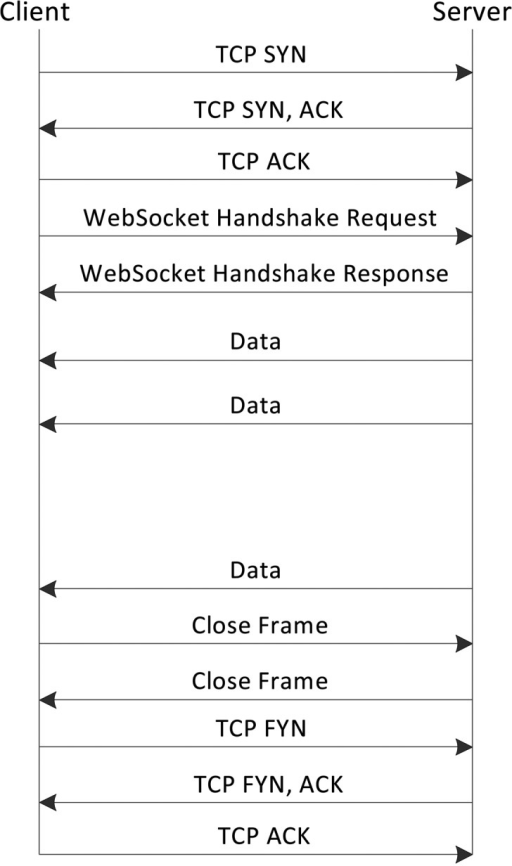

---
tags:
  - 네트워크
  - WebSocket
---
# 웹 소켓 통신 과정

- 소켓 연결을 유지하기 때문에 양방향 통신이 가능하다. 즉, 웹에서 사용하는 소켓이라 할 수 있다.
- 웹소켓과 HTTP 프로토콜 모두 OSI 모델에서 제7계층인 Application layer에 해당하며 제4계층인 TCP에 의존한다.
- TCP 소켓에서는 바이트 스트림을 사용하지만 웹 소켓에서는 UTF-8 포맷의 메시지 스트림만 허용한다.
- 웹소켓 통신 과정
    1. WebSocket Handshake
        1. 클라이언트 핸드쉐이크 요청
           
            ```json
            GET /chat HTTP/1.1
            Host: example.com:8000
            Upgrade: websocket
            Connection: Upgrade
            Sec-WebSocket-Key: dGhlIHNhbXBsZSBub25jZQ==
            Sec-WebSocket-Version: 13
            ```
            
            - `Upgrade`: 웹소켓 프로토콜로 프로토콜을 변경한다는 요청
            - `Sec-WebSocket-Key`: 핸드쉐이크에 필요한 키
            - `Connection`: 프록시에 더 이상 전송하지 않는 헤더 필드를 지정하는 헤더다. `Upgarde` 헤더는 hop-by-hop 헤더기 때문에 `Connection:Upgrade` 가 필요하다.
        2. 서버가 보내는 핸드쉐이크 응답
           
            ```jsx
            HTTP/1.1 101 Switching Protocols
            Upgrade: websocket
            Connection: Upgrade
            Sec-WebSocket-Accept: s3pPLMBiTxaQ9kYGzzhZRbK+xOo=
            ```
            
            - `Sec-WebSocket-Accept`: `Sec-WebSocket-Key` 에 의해 생선된 값
        
        <aside>
        💡 웹소켓 서버는 이미 연결된 클라이언트들의 반복적인 연결(DoS 공격 등)을 막기위해 클라이언트의 소캣 상태를 추적해야된다.
        
        </aside>
        
    2. 데이터 프레임 교환
        - [링크](https://developer.mozilla.org/ko/docs/Web/API/WebSockets_API/Writing_WebSocket_servers#%EB%8D%B0%EC%9D%B4%ED%84%B0_%ED%94%84%EB%A0%88%EC%9E%84_%ED%8F%AC%EB%A9%A7)를 참고하면 데이터 프레임의 구조를 알 수 있는데 직접 사용할 일이 있을지는 모르겠다.
        - 핸드쉐이크가 끝난 이후 서버나 클라이언트는 언제나 ping을 보낼 수 있다. 수산지는 가능한 빨리 응답으로 pong 패킷을 보내야된다. 서버는 주적으로 ping을 보내 클라이언트가 살아있는 상태인지 체크할 수 있다.
    3. 연결 닫기
        1. 클라이언트가 close 프레임을 서버에게 보낸다.
        2. 수신한 서버는 close 프레임을 보낸다.
        
        