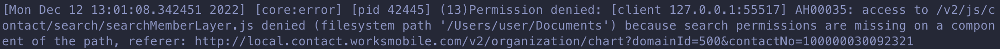

# Apache (13)Permission denied 문제

## 문제 상황

Apache에서 js나 css 파일 요청을 받으면 permission denied로 403 Forbidden 응답을 보내는 문제는 문제가 발생했다.

## 해결 방법

mac에서 사용할 경우 추가적인 설정이 필요하다.

- System Preferences => Security & Privacy => Full Disk Access
- httpd에 접근 권한 부여

## 참고 자료

- https://stackoverflow.com/questions/58455332/apache-gives-access-denied-on-macos-catalina