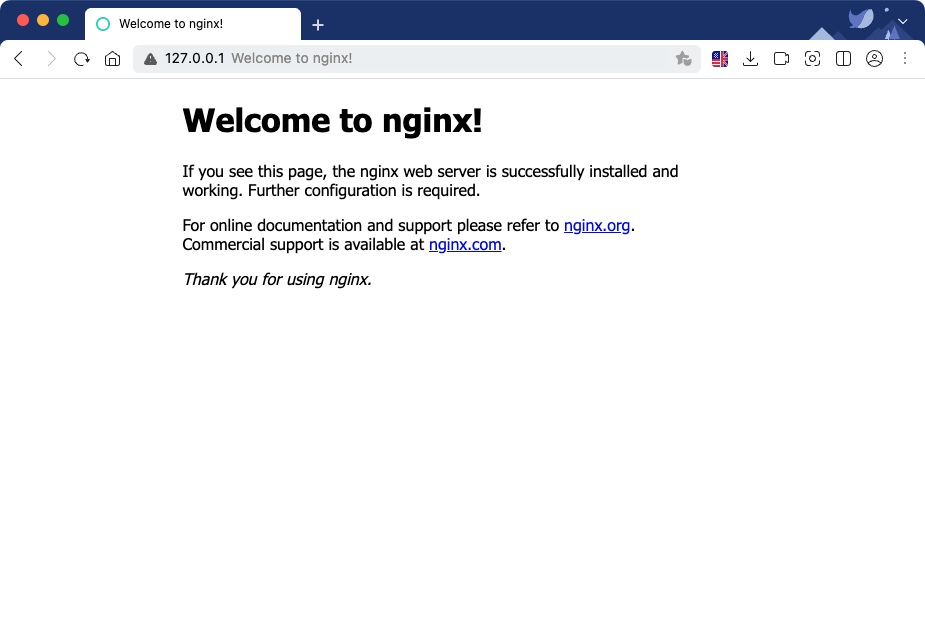

# Nginx 시작하기

## **Nginx 설치**

1. 소스 다운로드
   
    ```
    wget http://nginx.org/download/nginx-1.12.2.tar.gz
    tar xvzf nginx-1.12.2.tar.gz
    ```
    
2. 빌드
   
    ```
    cd nginx-1.12.2
    ./configure  --prefix=/home/{user}/apps/nginx-1.12.2 --user={user} --group={user} --error-log-path=/home/{user}/logs/nginx/error.log --http-log-path=/home/{user}/logs/nginx/access.log --without-http_rewrite_module  --without-http_scgi_module --without-http_uwsgi_module --without-http_fastcgi_module
    make
    make install
    ```
    
    - 옵션 설명
        - OS 사용자
            - `-user` : OS 사용자 계정. irteam을 권장한다.
            - `-group=irteam` : OS 사용자의 그룹. irteam을 권장한다.
        - 파일 경로
            - `-prefix` : Nginx 빌드 결과물이 들어갈 디렉토리
            - `-error-log-path`: 에러 로그를 저장할 경로
            - `-http-log-path` : 액세스 로그를 저장할 경로
        - 모듈 선언
            - `-without-http_scgi_module` : http_scgi_module 모듈 제외
            - `-without-http_uwsgi_module` : http_uwsgi 모듈 제외
            - `-without-http_fastcgi_module` : fastcgi_module 모듈 제외
            - `-without-http_rewrite_module` : http_rewrite_module 제외
            - `-with-http_ssl_module` : HTTPS로 서비스하기 위한 모듈 추가
            - `-with-http_v2_module` : HTTP/2로 서비스하기 위한 모듈 추가
        - 그 외 다양한 옵션
          
            [https://www.nginx.com/resources/admin-guide/installing-nginx-open-source/](https://www.nginx.com/resources/admin-guide/installing-nginx-open-source/)
            
- 트러블슈팅
    - 빌드 시에 c 컴파일러가 필요하다. ubuntu에서 아래 명령어를 통해 gcc 컴파일러를 설치할 수 있다.
      
        ```
        sudo apt install build-essential
        ```
        
    - 아래와 같은 오류로 zlib 라이브러리를 설치하라고 요구한다.
      
        ```
        ./configure: error: the HTTP gzip module requires the zlib library.
        You can either disable the module by using --without-http_gzip_module
        option, or install the zlib library into the system, or build the zlib library
        statically from the source with nginx by using --with-zlib= option.
        ```
        
        - 아래 방법으로 해결할 수 있다.
          
            ```
            sudo apt-get install zlib1g-dev
            ```
            
1. 실행
   
    ```
    cd apps/nginx/sbin
    ./nginx # 시작
    ./nginx -s reload ## 설정 리로드
    ./nginx -s stop ## 종료
    ```
    
    - 실행 결과 확인
      
        
    
2. HTTP/2 관련 모듈 설치
   
    ```
    cd /home/{user}/download
    wget https://www.openssl.org/source/openssl-1.0.2m.tar.gz
    tar xvzf openssl-1.0.2m.tar.gz
    ```
    
    ```
    ./configure --with-http_ssl_module --with-http_v2_module  --with-openssl=/home/{user}/download/openssl-1.0.2m  --prefix=/home/{user}/apps/nginx-1.12.2 --user={user} --group={user}  --without-http_scgi_module --without-http_uwsgi_module --without-http_fastcgi_module
    ```
    
3. Log 삭제 스크립트 지정
    - 주기적으로 로그 파일을 삭제해야된다.
    - shell 스크립트 형태로 실행
      
        ```
        #!/bin/bash
        
        # File date format
        DATE=`/bin/date --date="1 days ago" +%Y%m%d`
        # Archive period
        DAYS=30
        NGINX_PID_FILE=/home/{user}/apps/nginx/logs/nginx.pid
        NGINX_LOG_DIR=/home/{user}/logs/nginx
        NGINX_LOG_ARCHIVE_DIR=/home/{user}/logs/nginx
        ### Delete Nginx log ###
        function rotate_nginx_log {
                mv $NGINX_LOG_DIR/access.log $NGINX_LOG_ARCHIVE_DIR/access.log.$DATE
                mv $NGINX_LOG_DIR/error.log $NGINX_LOG_ARCHIVE_DIR/error.log.$DATE
                kill -USR1 `cat $NGINX_PID_FILE`
                find $NGINX_LOG_ARCHIVE_DIR -mtime +$DAYS -name "access.log.*" -exec rm {} \;
                find $NGINX_LOG_ARCHIVE_DIR -mtime +$DAYS -name "error.log.*" -exec rm {} \;
        }
        
        ### Main ###
        rotate_nginx_log
        ```
        
    - `crontab -e` 명령어를 통해 스크립트를 매일 실행
      
        ```
        0 0 * * * /home/{user}/scripts/rotatelog_nginx.sh
        ```
        

## **어플리케이션 서버 연동**

### **Proxy 방식의 연동**

- Nginx가 Proxy 서버 역할로 사용자의 요청을 뒷단의 서버로 넘긴다. proxy에 대한 선언이 반복될수도 있으므로 `proxy.conf` 와 같은 별도의 파일로 빼는 것이 좋다.
- /nginx/conf/nginx.conf
  
    ```
    http {
        # upstream으로 서버의 그룹을 지정할수 있다.
        # upstream의 이름은 proxy_pass 등의 선언에서 참조할 수 있다.
        upstream sevice-backend {
            server localhost:9001;
            # upstream 서버와 유지할 connection의 갯수를 keepalive로 설정한다.
            keepalive 100;
        }
    
        ...
    
        # 여러 path를 거쳐 서버에 들어오는 clinet ip를 얻어오기 위한 설정
        set_real_ip_from  127.0.0.1/32;
        real_ip_header    X-Forwarded-For;
    
        server {
            listen 80;
            location / {
                ...
                include proxy.conf;
                proxy_pass http://sevice-backend; # upstream 에 선언한 이름
            }
    }
    ```
    
- /nginx/conf/proxy.conf
  
    ```
    proxy_set_header   Host $host;
    proxy_set_header   Connection ""; # keep-alive를 활용하기 위한 헤더 설정
    proxy_set_header   X-Forwarded-For $remote_addr;
    proxy_set_header   X-Forwarded-Host $server_name;
    proxy_set_header   X-Real-IP $remote_addr;
    proxy_set_header   X-Forwarded-For $proxy_add_x_forwarded_for;
    proxy_set_header   X-Forwarded-Proto $scheme;
    
    proxy_http_version 1.1;
    proxy_max_temp_file_size 0;
    proxy_redirect off;
    proxy_read_timeout 240s;
    proxy_buffering off;
    proxy_ignore_client_abort on;
    ```
    
    - `proxy_http_version` : HTTP 프로토콜의 버전이다. 디폴트는 1.0 이다. keep-alive을 활용하기 위해서는 1.1로 명시해서 지정한다.
    - `proxy_buffering` : upstream 서버로 부터 받은 응답을 버퍼링할지의 여부이다. 디폴트는 `on` 이다. `off` 로 설정하면 Nginx는 뒷단의 서버로부터 받은 응답을 버퍼에 저장하지 않고 즉시 클라이언트에서 전송한다.
    - `proxy_max_temp_file_size` : 응답이 버퍼 크기를 넘어 갔을 때 사용할 임시파일의 최대 크기다. `proxy_buffering` 를 `on` 으로 지정했을 때만 이 속성이 의미가 있다. 디폴트는 값은 1024m이다. 0으로 설정하면 임시 파일을 사용하지 않는다.
    - `proxy_redirect` : upstream 서버에서 받은 응답에서 `Location` 과 `Refresh` 헤더를 바꿀지의 여부이다. 디폴트 값은 `off` 이다.
    - `proxy_read_timeout` : proxied server 로부터 응답을 읽는데 설정한 timeout 시간이다. 전체 응답 전송 timeout 시간이 아니라 두개의 연속적인 읽기 작업 사이의 timeout 시간이다. proxied server가 proxy_read_timeout에 지정한 시간안에 아무것도 전송하지 않으면 connection은 닫힌다. 디폴트 값은 60초이다.
    - `proxy_ignore_client_abort` : 클라이언트가 연결을 닫았을 때 프록시 서버와의 연결도 닫을지를 결정한다. 디폴트값은 `off` 이다.

### **AJP 연동**

- /nginx/conf/nginx.conf
  
    ```
    # ajp read timeout
    ajp_read_timeout 600;
    
    upstream sevice-backend {
        keepalive 512;
    }
    
    server {
        location / {
            ajp_keep_conn on;
            ajp_pass apiServer;
        }
    }
    ```
    

## **HTTPS 설정**

- /nginx/conf/nginx.conf
  
    ```
    server {
        listen 80;
        server_name service.naver.com;
        location /monitor/l7check {
            // 80포트로 L7 health check를 하고 있다면  301을 반환해서는 안된다.
        }
        location / {
            return 301 https://$server_name$request_uri;
        }
    }
    
    server {
        listen 443 ssl;
        ...
        # nginx 버전 1.15.0 부터는 ssl on 대신 listen 지시자 파라미터 ssl만 있으면 된다.
        ssl on;
        ssl_certificate  {인증서 경로};
        ssl_certificate_key {키 경로};
    
        ssl_protocols TLSv1 TLSv1.1 TLSv1.2;
        ssl_prefer_server_ciphers on;
        ssl_ciphers ECDHE-ECDSA-AES256-GCM-SHA384:ECDHE-RSA-AES256-GCM-SHA384:ECDHE-ECDSA-CHACHA20-POLY1305:ECDHE-RSA-CHACHA20-POLY1305:ECDHE-ECDSA-AES128-GCM-SHA256:ECDHE-RSA-AES128-GCM-SHA256:ECDHE-ECDSA-AES256-SHA384:ECDHE-RSA-AES256-SHA384:ECDHE-ECDSA-AES128-SHA256:ECDHE-RSA-AES128-SHA256;
        ....
    }
    ```
    
    - ssl_protocols : 사용할 프로토콜을 지정한다.
    - ssl_prefer_server_ciphers : SSLv3와 TLS 프로토콜을 사용할 때 서버에서 지정한 cipher의 cipher가 클라이언트의 cipher보다 우선시 될지의 여부이다. 디폴트는 `off` 이다.
    - ssl_ciphers : 제공할 Cipher를 우선 순위에 따라 적는다.