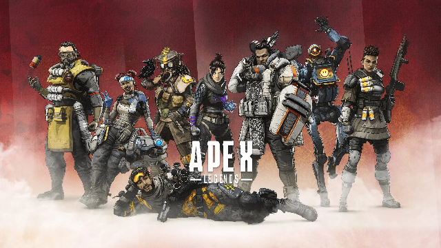

---
tags:
  - Java
title: 이미지 리사이징 및 압축
---


## 이미지 처리 방법

Java에서 이미지 처리하는 방법에는 여러 가지가 있다.

- AWT: Java 기본 라이브러리로 창 생성, 버튼 등의 GUI와 관련된 처리를 할 수 있도록 도와주는 라이브러리다.
- ImageJ: 이미지 작업을 위해 만들어진 라이브러리다. 만들어진 목적이 GUI가 아니라 처음부터 이미지 처리였기때문에 이미지 처리에대해 좋은 기능이 많이 있다.
- OpenIMAJ: 비디오, 오디오 처리나 머신 러닝 등의 작업을 할 수 있다. 이 라이브러리를 통해서도 이미지 처리를 할 수 있다.
- TwelveMonkeys ImageIO: Java 기본 라이브러리인 ImageIO를 확장한 형태다. 기존 ImageIO에서 다른 이미지 포맷도 지원해준다.

## AWT를 선택한 이유

복잡한 이미지 처리는 발생하지 않을 것으로 추정해서, 기본 라이브러리를 사용하기로 결정했다. 또한, 이미지 리사이징에대한 처리 성능을 측정한 결과를 찾아 봤는데 awt가 가장 빨랐다. 또한 Java의 이미지 프로세싱에 대한 자료가 awt를 사용한 경우가 제일 많이 발견되어서 선택했다.

- *java.awt.Graphics2D* – 34ms
- *Image.getScaledInstance()* – 235ms
- Imgscalr – 143ms
- Thumbnailator – 547ms
- Marvin – 361ms

[https://www.baeldung.com/java-resize-image#best-practice](https://www.baeldung.com/java-resize-image#best-practice) 참고

## AWT 시작하기

### 이미지 정보를 메모리로 가져오기

```java
BufferedImage bufferedImage = ImageIO.read(image.toFile());
```

`ImageIO.read()` 메소드를 사용하면된다. 파라미터로 파일뿐만 아니라 `URL`이나 `InputStream`을 넘겨줄 수도 있다.

### 이미지 리사이징

`Graphics2D` 를 이용한 방법을 사용할 것이다.

```java
BufferedImage resizedImage = new BufferedImage(targetWidth, targetHeight, BufferedImage.TYPE_INT_RGB);
Graphics2D graphics2D = resizedImage.createGraphics();
graphics2D.drawImage(originalImage, x, y, targetWidth, targetHeight, null);
graphics2D.dispose();
return resizedImage;
```

`BufferedImage` 생성자로 넘기는 타입의 경우는 아래의 [링크](https://docs.oracle.com/en/java/javase/11/docs/api/java.desktop/java/awt/image/BufferedImage.html)에서 설명을 볼 수 있다. ()하지만, 일반적으로 투명 채널이 필요한경우는 `TYPE_INT_ARGB` 를 쓰고, 필요없는 경우는 `TYPE_INT_RGB` 를 사용하면 되는 것으로 보인다.

`Graphics2D` 클래스는 Java에서 2차원 도형, 텍스트, 이미지를 렌더링하기 위한 클래스다. `BufferedImage` 에 있는 데이터를 2D 좌표에서 연산을 하기위해 사용했다.

`drawImage()` 메소드에 마지막으로 들어가는 파라미터는 이미지에 수정이 발생했을 때 알려주는 용도의 옵저버 객체인 `ImageObserver`를 추가한다. 사용하지 않을 경우 `null`을 넘기면된다. 

`Graphics2D` 는 다 사용했다면 리소스 해제를 시켜주기 위해서 `dispose()`를 호출해야된다.

### 이미지 리사이징 하면서 발생하는 문제

이미지를 아무 알고리즘 없이 리사이징 하게되면, 앨리어싱(계단현상)이나 어색한 리샘플링 기술로인해 이미지에 의도하지 않은 패턴이 생길 수 있다. 이를 해결하기 위해 interpolation이 필요하다. 

VALUE_INTERPOLATION_BICUBIC

VALUE_INTERPOLATION_BILINEAR

VALUE_INTERPOLATION_NEAREST_NEIGHBOR

위 같이 3개의 interpoliation이 있고 위로 올라갈수록 처리속도는 느려지지만 퀄리티는 좋아진다. cubic까지는 많이 사용하는 것으로 알고 있으므로 BICUBIC을 사용했다.

```java
Graphics2D graphics2D = resizedPicture.createGraphics();
graphics2D.setRenderingHint(RenderingHints.KEY_INTERPOLATION, RenderingHints.VALUE_INTERPOLATION_BICUBIC);
graphics2D.drawImage(myPicture, 0, 0, newWidth, newHeight, null);
graphics2D.dispose();
```

### 이미지 압축

이미지 파일의 크기를 최소화하기 위해서 압축을 했다. `ImageWriter` 를 사용하면 압축이 가능하다.

```java
File input = new File("digital_image_processing.jpg");
BufferedImage image = ImageIO.read(input);

File compressedImageFile = new File("compressed_image.jpg");
OutputStream os = new FileOutputStream(compressedImageFile);
ImageOutputStream ios = ImageIO.createImageOutputStream(os);

Iterator<ImageWriter> writers = ImageIO.getImageWritersByFormatName("jpg"); // 1
if (!writers.hasNext())
{
		throw new IllegalStateException("No writers found");
}
ImageWriter writer = writers.next();
writer.setOutput(ios);

ImageWriteParam param = writer.getDefaultWriteParam(); // 2

param.setCompressionMode(ImageWriteParam.MODE_EXPLICIT); // 3
param.setCompressionQuality(0.05f);  // 4
writer.write(null, new IIOImage(image, null, null), param); // 5

os.close();
ios.close();
writer.dispose();
```

1: jpg 형식을 처리할 수 있는 `ImageWriter`를 모두 가져온다.

2: `ImageWriteParam`을 통해서 `ImageWriteStream`이 인코딩하는 방법을 설정할 수 있다.

3: 사용자가 지정한 방법으로 압축을 하도록 설정한다. 기본값은 `MODE_COPY_FROM_METADATA`로 이미지 메타데이터에 저장된 방식으로 압축을 하는 것이다.

4: 압축률을 지정한다. 숫자가 높을수록 화질이 좋아지고 파일 크기가 커진다.

5: `BufferedImage`의 이미지 데이터를 `ImageWriter`에 입력한다.

## 결과



가로 길이 640px로 리사이징한 결과인데 생각보다 화질이 별로였다. 인터포레이션도 설정도 제일 좋은 것으로 설정했는데 결과가 이런 걸보면 한계가 있어보였다.

> *Image.getScaledInstance()*

그래서 아까 언급했던 방법인 Java에서 기본으로 제공하는 라이브러리 중 또 다른 방법을 선택해서 시도해봤다.

```java
Image resultingImage = original.getScaledInstance(imageSize.getWidth(), imageSize.getHeight(), Image.SCALE_SMOOTH);
BufferedImage outputImage = new BufferedImage(imageSize.getWidth(), imageSize.getHeight(), BufferedImage.TYPE_INT_RGB);
outputImage.getGraphics().drawImage(resultingImage, 0, 0, null);
return outputImage;
```

스케일링 할 때 파라미터로 `Image.SCALE_SMOOTH`를 사용하게 되니 아래와 같이 깔끔한 이미지가 나왔다.


왜 이런 차이가 발생하는지 잘 모르겠다. `getScaledInstance()` 메소드 내부를 보니 `SCALE_SMOOTH`일 경우 AreaAveragingScaleFilter 즉 box filter를 사용하는 건데 그럼 앞에서 사용한 방법인 `VALUE_INTERPOLATION_BICUBIC` 이 이미지 퀄리티가 더 좋아야 정상이다.

음... 좀 찾아보니 `Graphics2D` 의 interpolation 기술에 버그 리포트 된 것이 많이 보인다. 이것도 버그이려나... 특히 맥북에서 사용하면 적용이 안된다는 글이 많다 ㅋㅋㅋ

[https://bugs.java.com/bugdatabase/view_bug.do?bug_id=4950176](https://bugs.java.com/bugdatabase/view_bug.do?bug_id=4950176)

[https://stackoverflow.com/questions/23552126/graphics2d-interpolation-not-playing-well-with-very-small-bufferedimages](https://stackoverflow.com/questions/23552126/graphics2d-interpolation-not-playing-well-with-very-small-bufferedimages)

[https://stackoverflow.com/questions/56804144/java-graphics2d-interpolation-doesnt-seem-to-work-on-resized-images](https://stackoverflow.com/questions/56804144/java-graphics2d-interpolation-doesnt-seem-to-work-on-resized-images)

[https://github.com/qzind/tray/issues/38](https://github.com/qzind/tray/issues/38)

## 참고자료

[https://www.baeldung.com/java-images](https://www.baeldung.com/java-images)

[https://www.baeldung.com/java-resize-image](https://www.baeldung.com/java-resize-image)

[https://docs.oracle.com/en/java/javase/11/docs/api/java.desktop/java/awt/image/BufferedImage.html](https://docs.oracle.com/en/java/javase/11/docs/api/java.desktop/java/awt/image/BufferedImage.html)

[https://docs.oracle.com/javase/tutorial/2d/advanced/quality.html](https://docs.oracle.com/javase/tutorial/2d/advanced/quality.html)
