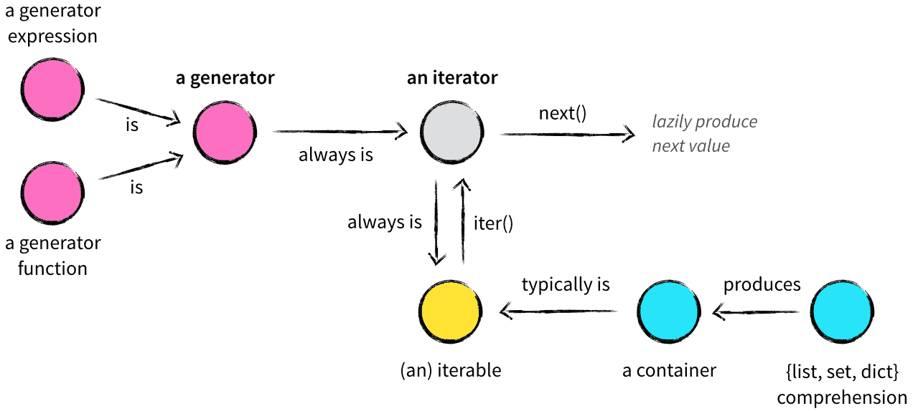

---
tags:
  - Python
title: 이터레이터, 제너레이터, yield
---


## 이터레이터(iterator)

이터레이터는 값을 차례대로 꺼낼 수 있는 객체다. 우리가 for 반복문을 사용할 때 요소를 하나씩 꺼내서 처리할 수 있게 되는데, 이터레이터를 사용했기 때문에 가능한 것이다. 어떤 클래스가 이터레이터이기 위해서는 다음 조건을 만족해야된다.

- `__iter__` 메소드를 구현하되 자기 자신(`self`)을 반환한다.
- `__next__` 메소드를 구현해서 `next` 내장 함수의 인자로 자신을 줬을 때 다음에 반환할 값을 정의해야된다.
- 더 이상 반환할 값이 없는 경우 `__next__`메소드는 `StopIteration` 예외를 일으키도록 한다.

## 이터러블(iterable)

말 그대로 '순회 가능한'이라는 뜻이다. for 문의 `in` 키워드 뒤에 올 수 있는 모든 값을 이터러블이다. 어떤 클래스가 이터러블이 되기 위해서는 아래의 조건을 만족해야된다.

- `__iter__` 메소드를 구현해야 하며 이 메소드를 호출할 때마다 새로운 이터레이터가 반환된다.

## 제네레이터(Generator)

이터레이터와 이터러블을 구현할 수 있는 클래스가 있는데 이것이 제네레이터다. for 반복문에서 사용하기위해서는 이터레이터와 이터러블을 만족하는 클래스를 구현해야 된다. 우리는 이를 이터레이터 프로토콜(Iterator Protocol)을 준수한 클래스라고한다. 하지만 이런 조건들을 매번 만족해야되는 것은 번거로울 수 있다. 제네레이터를 사용하면 이런 번거로움을 해결할 수 있다. 제네레이터를 생성하는 방법에는 2가지가 있다.

### yield

yield 키워드의 특징은 클래스가 아닌 함수로 정의가 가능하다는 것이다. 호출될 때마다 한 번씩 반환할 값을 반환하게 된다. yield를 사용하면 함수 바깥으로 값을 전달하고 코드 실행을 잠깐 함수 바깥으로 양보하게 되는 것이다.

```python
from random import randint

def random_number_generator(n):
    count = 0
    while count < n:
        yield randint(1, 100)
        count += 1
```

### Generator comprehension

list comprehension과 비슷하다. 대괄호대신 소괄호를 사용하면 제네레이터를 생성할 수 있다.

```python
from random import randint

g = (randint(1, 100) for _ in range(5))
```

## 이터레이터, 이터러블, 제네레이터 관계



## 리스트가 아닌 이터레이터나 제네레이터를 사용하면 좋은 이유

이터레이터와 제네레이터를 생성할 필요없이 항상 리스트를 사용하면 되지 않냐는 의문을 가질 수도 있다. 이터레이터와 제네레이터를 사용하는 이유는 Lazy evauluation 때문이다. 리스트는 for문에 사용하기위해서 모든 요소들을 메모리 위에 올려두고 있어야되지만, 이터레이터와 제네레이터는 다음 요소가 필요한 순간에 메모리에 올려서 사용하게 된다. 따라서 매우 큰 크기를 가지는 자료구조를 다룰 일이 있다면 리스트보다는 이터레이터, 제네레이터를 사용하는 것을 권장한다.

## 참고 자료

[https://shoark7.github.io/programming/python/iterable-iterator-generator-in-python#4a](https://shoark7.github.io/programming/python/iterable-iterator-generator-in-python#4a)

[https://mingrammer.com/translation-iterators-vs-generators/](https://mingrammer.com/translation-iterators-vs-generators/)

[https://dojang.io/mod/page/view.php?id=2412](https://dojang.io/mod/page/view.php?id=2412)
