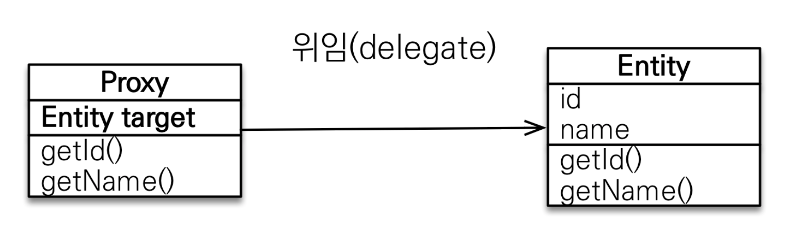

---
tags:
  - JPA
title: 지연 로딩
---


## 즉시 로딩과 지연 로딩

```java
@Entity
public class Member {
	@ManyToOne
	@JoinColumn(name = "TEAM_ID")
	private Team teams;

	// ...
}
```

- 즉시 로딩(`@ManyToOne(fetch = FetchType.EAGER)`): `Member`라는 엔티티를 조회할 때 연관된 엔티티인 `Team` 도 같이 조회된다.
- 지연 로딩(`@ManyToOne(fetch = FetchType.LAZY)`): `Member`라는 엔티티를 조회할 때 `Team`을 조회하지 않다가, 실제로 사용할 떄 조회한다. ex) `member.getTeam()`

## 지연 로딩의 동작 방법

만약, 위 예시에서 team이 지연로딩()을 사용 중이라면 `member.getTeam()` 을 호출했을 때의 `Team`은 프록시 객체다. 그리고 이 프록시 객체는 실제 사용될 때 까지 로딩을 미룬다. `team.getName()` 과 같은 실제 데이터가 필요한 경우 로딩이 시작된다. 만약, `Team` 객체가 영속성 컨텍스트에 이미 로딩되어 있는 상태였다면 프록시가 아닌 실제 객체를 사용한다.

엔티티에 컬렉션이 있는 경우는 원본 컬렉션을 하이버네이트가 제공하는 내장 컬렉션으로 변경하는데 이것을 컬렉션 래퍼라 한다. 컬렉션 래퍼도 켤렉션에 대한 프록시 역할을 하고있다.

## 즉시 로딩, 지연 로딩 활용 예시

항상 지연 로딩을 사용하는 것이 좋은 것은 아니다. 만약 위 예시에서 `Member`가 로딩될 때 `Team` 엔티티가 자주 조회된다면 즉시 로딩을 사용하는 것이 효율적이다. 지연 로딩을 사용할 경우 항상 두 번의 쿼리를 호출해야되기 때문이다. 따라서 일단은 모든 로딩에 대해서 지연 로딩을 사용한 후, 애플리케이션 개발이 어느 정도 완료단계에 왔을 때 실제 사용하는 상황을 보고 자주 함께 조회되는 경우는 즉시 로딩을 사용하도록 최적화 하는 것이 좋다.

## JPA 기본 페치 전략

- `@ManyToOne`, `@OneToOne`: 즉시 로딩
- `@OneToMany`, `@ManyToMany`: 지연 로딩

## 즉시 로딩 사용시 주의점

### 컬렉션을 하다 이상 즉시 로딩하는 것은 권장하지 않는다.

엔티티 하나에 서로 다른 컬렉션을 2개 이상 조인하게 된다면 애플리케이션 성능이 저하될 수 있다. A 테이블에 N, M 두 테이블과 조인하면 SQL 실행 결과가 N * M개가 나오면서 너무 많은 데이터를 반환할 수 있다.

### 컬렉션 즉시 로딩은 항상 외부 조인을 사용한다.

다대일 관계일 경우 내부 필드가 not null 제약조건이 있다면 내부 조인을 사용해도 된다. 하지만 일대다 관계일 경우 문제가 발생한다. `Team` 엔티티 안에 `getMembers()`를 호출할 때, 만약 내부 조인일 경우 회원이 없는 팀이면 팀까지 조회가 되지않을 수 있기때문이다. JPA 즉시 로딩의 조인 전략은 다음과 같다.

- `@ManyToOne`, `@OneToOne`
    - (optional = false): 내부 조인
    - (optional = true): 외부 조인
- `@OneToMany`, `@ManyToMany`
    - (optional = false): 외부 조인
    - (optional = true): 외부 조인

위의 지연로딩 기능을 사용하기 위해서 사용하는 가짜객체를 프록시 객체라고 부른다. 지연 로딩을 지원하기 위해서는 프록시를 사용하는 방법과 바이트코드를 수정하는 두 가지 방법이 있는데 지금은 프록시에대해 설명하겠다. 데이터베이스 조회를 엔티티를 직접 사용하는 시점까지 미루고 싶으면 `EntityManger.find()` 가 아닌 `EntityManager.getReference()` 메소드를 사용하면 된다. 

## 프록시 객체의 구조



프록시 클래스는 실제 클래스를 상속 받아서 만들어진다. 또한 프록시 객체는 실제 객체에 대한 참조를 보관한다. 프록시 객체의 메소드를 호출하면 프록시 객체는 실제 객체의 메소드를 호출한다.

- 프록시 객체의 초기화
  

    위 사진의 경우 `member.getName()`처럼 실제 사용될 때 데이터베이스를 조회해서 실제 엔티티 객체를 생성하는데 이것을 프록시 객체의 초기화라 한다. 아래는 프록새 클래스의 구현을 간단하게 나타낸 것이다.

    ```java
    class MemberProxy extends Member {
    	Member target = null; //실제 엔티티 참조
    	public String getName() {
    		if(target == null) {
    			this.target = ...;
    		}	
    	}
    	return target.getName();
    }
    ```

    따라서, 프록시 객체를 초기화한다고 프록시 객체가 실제 엔티티로 바뀌는 것이 아니다. 프록시 객체가 초기화되면 프록시 객체를 통해서 실제 엔티티에 접근할 수 있다.

    
- 준영속 상태의 프록시 초기화
  

    만약 준영속 상태인 엔티티에게 프록시 초기화를 요청하게 된다면 영속석 컨텍스트가 이미 없으므로 실제 엔티티를 조회할 수 없다. `LazyInitializationException` 예외가 발생하게 된다.

    

## 프록시와 식별자

엔티티는 프록시로 조회할 때 식별자 값을 파라미터로 전달하는데 프록시 객체는 이 식별자 값을 보관한다. 따라서, 식별자 값을 조회하는 메소드를 호출해도 프록시를 초기화하지 않는다.

```java
Team team = em.getReference(Team.class, "team1"); // 식별자 보관
team.getId(); // 초기화되지 않음
```

단, 엔티티 접근 방식으로 프로퍼티(`@Access(AccessType.PROPERTY)`)로 했을 경우에만 그렇게 동작한다. 엔티티 접근 방식을 필드(`@Access(AccessType.FIELD)`)로 해두면 `getId()`같은 호출에도 프록시 객체를 초기화한다.

## 프록시 확인

`PersistenceUnitUtil.isLoaded(Object entity)`메소드를 사용하면 프록시 인스턴스의 초기화 여부를 확인할 수 있다.

자바 ORM 표준 JPA 프로그래밍 (김영한)
