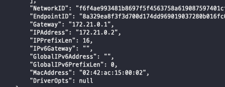

---
tags:
  - Docker
title: 컨테이터 IP 확인하기
---

docker위에서 돌아가고 있는 WAS가 docker 위에 올라가 있는 DB에게 연결을 계속 실패하는 문제가 있었다. 분명 `docker inspect` 명령어로 확인한 IP 주소 값인데 왜 연결에 실패하는지 이해가 되지 않았다. docker를 사용하면 `docker0`라는 네트워크 인터페이스가 생긴다. docker에서는 이 네트워크 인터페이스에 `bridge`라는 네트워크 드라이버를 제공하고있다. 그래서 docker를 설치한 직후에 `docker network ls` 명렁어를 입력하면 아래와 같이 bridge 드라이버를 사용중인 네트워크를 볼 수 있다. 또한 아무 설정없이 컨테이너를 만들면 이 기본 bridge 네트워크에 연결하게 된다.

docker0 네트워크 인터페이스에 새로운 네트워크를 생성하고 싶으면 `docker network create` 같은 명령어를 사용할 수 있는데 주제에서 벗어나니 [링크](https://docs.docker.com/engine/reference/commandline/network_create/)를 참고하기를 바란다.

컨테이너는 여러 개의 네트워크에 속할 수 있고, 해당 네트워크 서브넷에 맞는 IP를 각각 따로 할당받는다. 그래서 결론을 말하자면 잘못된 네트워크의 IP 주소를 확인하고 있었다! 기본 네트워크인 `bridge`의 IP 주소를 확인했어야 됐는데, `db_default`라는 네트워크의 IP 주소를 확인하고 있었던 것이다...

## 참고 자료

[https://www.freecodecamp.org/news/how-to-get-a-docker-container-ip-address-explained-with-examples/](https://www.freecodecamp.org/news/how-to-get-a-docker-container-ip-address-explained-with-examples/)

[https://docs.docker.com/engine/reference/commandline/network_create/](https://docs.docker.com/engine/reference/commandline/network_create/)

[https://jonnung.dev/docker/2020/02/16/docker_network/](https://jonnung.dev/docker/2020/02/16/docker_network/)
