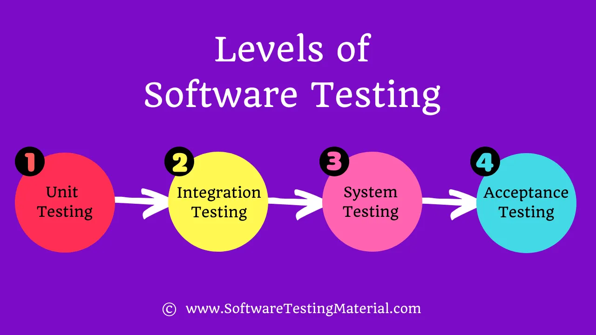

---
tags:
  - 테스트
title: 테스트 종류
---

최근 수업 시간을 통해 단위 테스트나 통합 테스트 같은 코드 동작 테스트만 있는게 아니라 부하 테스트, 성능 테스트도 필요하다는 사실을 알게되었다. 이외에도 어떤 테스트가 있고 우리는 개발에 어떤 테스트가 필요한지 알아보도록한다.

## 테스트 접근법

테스트를 하기 위해서는 3가지의 접근법이 있다고한다.

### 화이트 박스 테스트

애플리케이션 내부의 코드를 기반으로 테스트를 진행한다. 모든 코드 라인을 거쳐 변수에 의도한 값이 저장되어 있는지, 의도한대로 분기문을 거치는지 등의 개발자가 이해할 수 있는 수준의 테스트 코드를 작성한다. 화이트 박스 테스트의 경우 불필요한 코드를 제거하는 등의 최적화를 할 수 있는 장점이 있다. 하지만, 리팩토링 등의 코드 재설계가 있을 때마다 테스트 코드를 새로 작성해야되는 경우가 많다.

### 블랙 박스 테스트

코드 내부를 직접 보지않고 소프트웨어의 기능을 테스트한다. 올바른 입력과 올바르지 않는 입력을 하여 의도한 출력이 발생하는지 확인한다. 

### 그레이 박스 테스트

위의 화이트 박스 테스트와 블랙 박스 테스트를 결합한 형태다. 내부 구현에 대해서 어느 정도의 지식이 필요하고 한다.

## 블랙 박스 테스트의 종류

### 기능 테스트

소프트웨어의 각 기능이 요구 사항대로 동작하는지 확인한다. 특정 입력에 대해서 예상하는 출력과 실제 출력이 일치하는지 테스트한다.

### 비기능 테스트

성능, 부하, 스트레스, 보안, 호환성 등의 테스트를 말한다. 기능이 아닌 사용자 경험을 개선하기 위한 테스트다. 

- 성능 테스트: 소프트웨어의 응답 시간, 처리량, 리소스 활용 수준을 목표하는 만큼 달성하는지 확인한다.
- 부하 테스트: 소프트웨어가 목표하는 부하를 견딜 수 있는지 확인한다.
- 스트레스 테스트: 목표한 부하를 넘겼을 경우 소프트웨어가 어떻게 동작하는지 확인하는 테스트다.
- 보안 테스트: 시스템이 특정 데이터를 보호하고 기능을 의도하는 대로 유지하는지 확인하는 테스트다.
- 호환성 테스트: 소프트웨어가 어려 환경에서 정상적으로 동작하는지 확인한다.

## 테스트 레벨

### 단위 테스트(Unit Test)

소프트웨어의 개별 모듈이 정상적으로 작동하는지 테스트한다. 화이트 박스 테스트가 주로 진행된다. 단위 테스트를 통해 디버깅시 버그가 발생하는 부분을 빠르게 찾을 수 있다. 

### 통합 테스트(Integration Test)

두 개의 모듈이 정상적으로 상호 작용하는지 테스트한다. 두 개의 모듈이 결합하면서 발생하는 결함을 발견하기위해서 사용한다.

### 시스템 테스트(End to End Test)

완전히 통합된 소프트웨어가 요구 사항을 만족하는지 확인하기 위해 테스트한다. 주로 블랙 박스 테스트의 기능 테스트와 비기능 테스트가 이루어지고, 성공 케이스와 실패 케이스 모든 경우에 대해서 정상적으로 동작하는지 확인한다.

### 수락 테스트(Acceptance Test)

고객이 요구사항을 충족하는지 확인하는 테스트다. 기능 테스트만 진행되며 알파 테스트, 베타 테스트가 수락 테스트에 포함된다. 

- 알파 테스트: 소프트웨어 개발자와 테스터가 진행한다.
- 베트 테스트: 임의의 제한된 수의 최종 사용자에게 소프트웨어를 사용해보도록 하여 테스트를 진행한다.

## 참고 자료

[https://www.softwaretestingmaterial.com/software-testing/#h-black-box-testing](https://www.softwaretestingmaterial.com/software-testing/#h-black-box-testing)

[https://www.geeksforgeeks.org/software-engineering-white-box-testing/](https://www.geeksforgeeks.org/software-engineering-white-box-testing/)

[https://kkhipp.tistory.com/158](https://kkhipp.tistory.com/158)

[https://www.softwaretestingmaterial.com/types-of-software-testing/](https://www.softwaretestingmaterial.com/types-of-software-testing/)

[https://www.geeksforgeeks.org/types-software-testing/](https://www.geeksforgeeks.org/types-software-testing/)
