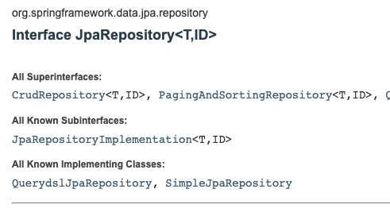

# Spring data JPA 사용시 @Transactional을 붙이지 않으면 영속성 컨텍스트가  어떻게 동작할까?

동작방식을 이해하기 위해서 `JpaRepository`의 기본 구현체를 확인해볼 필요가 있었다.

기본 구현체인 `SimpleJpaRepository` 코드를 확인해보니, class 레벨에 `@Transactional(readOnly = true)`가 설정되어 있고, 쓰기 메서드에 각각 `@Transactional`이 명시되어 있었다. 따라서, 기본적으로 각 메서드 호출마다 영속성 컨텍스트가 별개로 만들어져서 엔티티가 관리된다. 

## 참고 자료

[https://docs.spring.io/spring-data/jpa/docs/current/api/org/springframework/data/jpa/repository/support/SimpleJpaRepository.html](https://docs.spring.io/spring-data/jpa/docs/current/api/org/springframework/data/jpa/repository/support/SimpleJpaRepository.html)

[https://www.baeldung.com/jpa-hibernate-persistence-context](https://www.baeldung.com/jpa-hibernate-persistence-context)