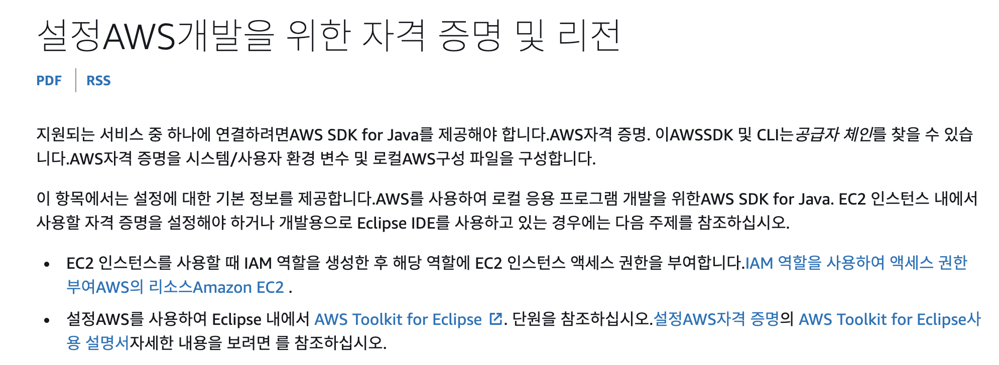
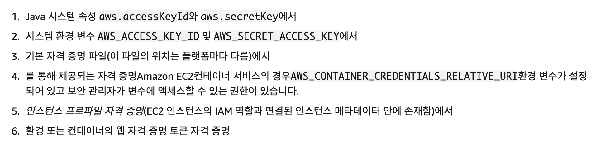

# Spring with AWS S3

다른 크루들의 이야기를 들어보니 Spring과 S3 연결이 access key 가 없어도 된다고해서 시도해보고 있다. Spring 애플리케이션이 AWS의 EC2에 부여한 IAM 권한을 이용해서 S3와 연결이 가능하다고 한다.



## 의존성 추가

이것 저것 찾아다니면서 의존성 추가를 시도해봤는데 테스트가 전부 터지거나 의존성 추가에 실패했다. Spring 공식문서 방시대로 하니 다행이 잘 동작했다.

```groovy
implementation 'org.springframework.cloud:spring-cloud-aws-context:2.2.6.RELEASE'
```

## 접근 권한

AWS 자원들에 접근 권한을 얻기 위해서는 아래의 과정을 순서대로 거쳐서 만족하면 된다. 5번의 경우가 내가 사용하려고 하는 접근 권한 얻는 방법이다. 따라서 다음과 같이 accees key를 설정하지 않도 다음과 같은 방법으로 객체를 만들어 줄 수 있다.



## S3에 있는 파일 리스트 가져오기

```java
final AmazonS3 s3 = AmazonS3ClientBuilder.standard().withRegion(Regions.DEFAULT_REGION).build();
ListObjectsV2Result result = s3.listObjectsV2(bucket_name);
List<S3ObjectSummary> objects = result.getObjectSummaries();
for (S3ObjectSummary os : objects) {
    System.out.println("* " + os.getKey());
}
```

aws 공식 문서에 나와있는 방법을 사용해서 S3에 접근하니 성공적으로 파일들이 보인다. 나같은 경우는 서울 지역 S3를 사용하기 때문에 `Regions.AP_NORTHEAST_2` 를 사용했다.

## S3에 파일 업로드

```java
System.out.format("Uploading %s to S3 bucket %s...\n", file_path, bucket_name);
final AmazonS3 s3 = AmazonS3ClientBuilder.standard().withRegion(Regions.DEFAULT_REGION).build();
try {
    s3.putObject(bucket_name, key_name, new File(file_path));
} catch (AmazonServiceException e) {
    System.err.println(e.getErrorMessage());
    System.exit(1);
}
```

## 참고 자료

[https://docs.aws.amazon.com/ko_kr/sdk-for-java/v1/developer-guide/setup-credentials.html](https://docs.aws.amazon.com/ko_kr/sdk-for-java/v1/developer-guide/setup-credentials.html)

[https://docs.aws.amazon.com/sdk-for-java/v1/developer-guide/examples-s3-objects.html#list-objects](https://docs.aws.amazon.com/sdk-for-java/v1/developer-guide/examples-s3-objects.html#list-objects)

[https://docs.awspring.io/spring-cloud-aws/docs/current/reference/html/index.html](https://docs.awspring.io/spring-cloud-aws/docs/current/reference/html/index.html)