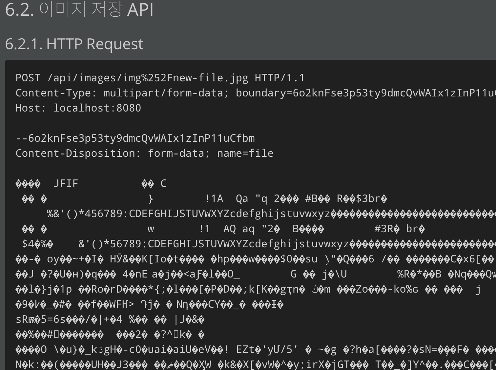

# Mockmvc에서 body 내용 수정하기

multipart 를 통해 파일을 body로 보내는데, 이미지라서 바이트 데이터로 보내게된다. 



rest-docs에서는 이를 굳이 보여줄 필요가 없기 때문에, body내용을 바꾸는 기능이 필요했다. 이를 위해서는 `preprocessRequest` 라는 것을 사용하면 된다.

```java
// MockMvc 테스트 중에
.andDo(document("save-image",
		preprocessRequest(new ImageBodyPreprocessor()),
		responseFields(
		    fieldWithPath("[]").description("파일 경로"))));
```

```java
public class ImageBodyPreprocessor implements OperationPreprocessor {

    private static final String FILE = "file";
    private static final OperationRequestPartFactory PART_FACTORY = new OperationRequestPartFactory();
    private static final OperationRequestFactory REQUEST_FACTORY = new OperationRequestFactory();

    @Override
    public OperationRequest preprocess(final OperationRequest request) {
        List<OperationRequestPart> parts = new ArrayList<>();

        for (OperationRequestPart part : request.getParts()) {
            if (FILE.equals(part.getName())) {
                parts.add(PART_FACTORY.create(
                    part.getName(),
                    part.getSubmittedFileName(),
                    "<<binary data>>".getBytes(),
                    part.getHeaders()
                ));
                continue;
            }
            parts.add(part);
        }

        return new OperationRequestFactory().create(
            request.getUri(),
            request.getMethod(),
            request.getContent(),
            request.getHeaders(),
            request.getParameters(),
            parts
        );
    }

    @Override
    public OperationResponse preprocess(final OperationResponse response) {
        return response;
    }
}
```

위 코드와 같이 file이라는 part의 내용을 수정해야됐다.


위 결과와 같이 바이트 데이터대신 '<<binary data>>'라는 문자가 보이도록 수정했다.

## 참고 자료

[https://stackoverflow.com/questions/60677805/mask-headers-in-spring-restdocs](https://stackoverflow.com/questions/60677805/mask-headers-in-spring-restdocs)