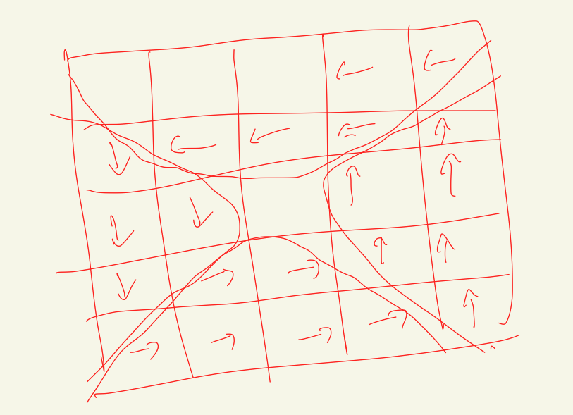

# 21611

편집 시간: 2022년 4월 29일 오후 8:36

## 코드

[Algorithm/21611.py at main · Junroot/Algorithm](https://github.com/Junroot/Algorithm/blob/main/baekjoon/21611.py)

## 풀이

처음에는 구슬 정보를 하나의 리스트로 표현해서 처리해보려고했다. 하지만 이 방법은 블리자드가 일어나는 인덱스를 계산하는데 상당히 복잡해졌다.

두 번째 접근 방법으로 격자를 나타내는 이중 배열에서 문제의 조건들을 처리하도록 구현했다. 이 때 현재 위치에서 다음 위치를 계산하는 과정이 필요했는데 이를 그림으로 그려보니 규칙이 보였다. 이를 수식으로 구한 뒤 다음위치를 찾을 수 있는 로직을 완성했다.

추가적으로 블리자드가 일어난 뒤 중간에 빈 칸이 발생한 것을 앞으로 한칸씩 미는 과정을 굳이 구현할 필요가 없다. 구슬 폭발 계산할 때 빈 칸인 부분은 무시하고 계산하면 되기 때문이다.