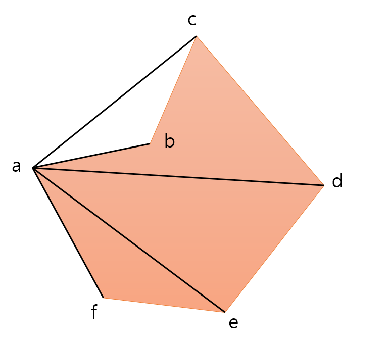

# 2166

오답 여부: o
편집 시간: 2022년 4월 4일 오후 6:27

## 코드

[Algorithm/2166.py at main · Junroot/Algorithm](https://github.com/Junroot/Algorithm/blob/main/baekjoon/2166.py)

## 풀이

여러개의 삼각형으로 나누어서 면적을 합하면 되겠다고는 빠르게 생각해냈다. 하지만 아래와 같은 문제가 있었다.

### 좌표 3개가 주어졌을 때, 삼각형 면적 구하기

벡터의 외적을 사용할 생각을 전혀못했다. 두 벡터 a, b가 있을 때 두 벡터를 외적한 벡터의 크기는 |a||b|sinθ 라는 것을 완전히 잊고 있었다.

### 오목 다각형의 경우

삼각형의 면적을 단순히 모두 더해서 반환하면 될거라고 생각했다. 하지만 이는 볼록 다각형의 경우에만 해당한다. 오목 다각형일 경우를 생각해줘야된다.

이 경우를 해결하기 위해서는 두 가지를 생각하면된다.

1. 세 점을 선택했을 때 나오는 모든 면적이 볼록하면 더하고, 오목하면 빼주면된다.
2. 오목한 부분에서는 외적의 방향이 반대로 나타난다.

