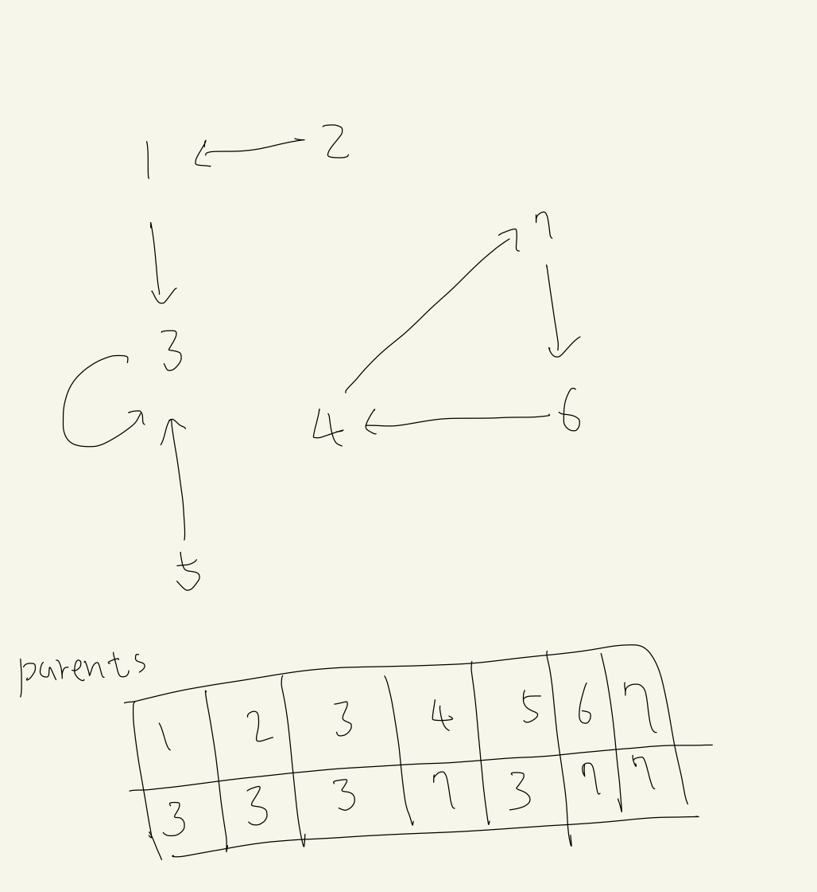

# 9466

편집 시간: 2022년 3월 23일 오후 10:19

## 코드

[Algorithm/9466.py at main · Junroot/Algorithm](https://github.com/Junroot/Algorithm/blob/main/baekjoon/9466.py)

## 풀이

사이클이 존재하는지 확인하는 과정이 필요했다.

서로소 집합을 사용해서 사이클이 존재하는지 확인했다. 선호하는 학생을 나타내는 구조를 방향 그래프로 그렸을 때 자신이 방향을 따라 갔을 때 최종적으로 가리키게 되는 숫자를 parent라고 정의한다.

배열을 이용해서 parent를 관리하다가, parent가 자기 자신이라면 사이클이 발생한 것이라고 확인할 수 있다.



### 다른 풀이

위상 정렬을 이용해서도 사이클을 구할 수 있다.

```python
import sys
from collections import deque
input = sys.stdin.readline
T = int(input())
for _ in range(T):
    n = int(input())
    nums = [0] + list(map(int, input().split()))
    from_count = [0 for _ in range(n+1)]
    for num in nums:
        from_count[num] += 1

    d = deque()
    for i in range(1, n+1):
        if from_count[i] == 0:
            d.append(i)
            from_count[i] -= 1

    answer = 0
    while d:
        student = d.pop()
        answer += 1
        from_count[nums[student]] -= 1
        if from_count[nums[student]] == 0:
            d.append(nums[student])

    print(answer)
```