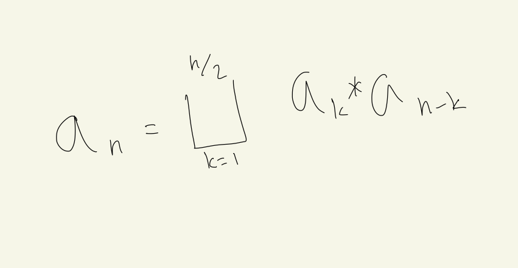

# 42895

날짜: 2022년 1월 31일 오후 5:51

## 코드

[Algorithm/42895.py at main · Junroot/Algorithm](https://github.com/Junroot/Algorithm/blob/main/programmers/42895.py)

## 풀이

DP로 문제를 해결할 때, 어떤 값을 기준으로 점화식을 만들지 정하는 것에 어려움이 있었다. 고민 끝에 내린 결론은 $a_n$을 (N을 n번 사용해서 만들 수 있는 수의 집합)이라고 정의했다. 그렇데되면 점화식은 다음과 같다.

여기서 *연산은 (좌변의 원소와 우변의 원소가 사칙연산을 해서 나올 수 있는 값들의 집합)이다. 사칙 연산은 어차피 좌변과 우변의 연산으로 이루어지기 때문에 점화식은 성립 가능하다.

이 때, 한 가지 예외가 있으니 주의해야된다. 5, 55, 555같은 수는 사칙연산으로 얻는 값이 아니기 때문에 상향식으로 계산할 때 미리 값을 입력해두어야된다.