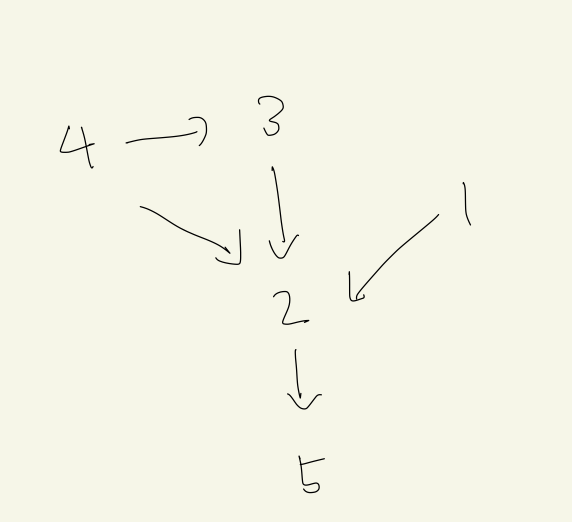

# 49191

날짜: 2022년 1월 31일 오후 5:51

## 코드

[Algorithm/49191.py at main · Junroot/Algorithm](https://github.com/Junroot/Algorithm/blob/main/programmers/49191.py)

## 풀이

자신이 이길 수 있는 상대인지 확인하기 위해서 방향그래프 사용하니 해결할 수 있었다. a가 b를 이겼다고 했을 때, a→b로 연결하는 식으로 그래프를 만들면된다. 문제의 예시의 경우는 아래 그림과 같다.

이렇게 그래프를 만든 뒤, 자신이 도착할 수 있는 노드들은 모두 자신이 이길 수 있는 선수들이 된다. 4는 (2, 3, 5)를 이길 수 있다.

자신이 지는 선수의 경우에도 위의 방법으로 그래프를 그려서 구할 수 있다. 이렇게 두 가지 그래프를 다 구한 후, 자신을 제외한 모든 선수들의 승패를 판별 할 수 있다면 count를 1씩 늘리면된다.

그리고 모든 선수에대해서 계산을 해야되기 때문에 플로이드-워셜 알고리즘을 사용하여 해결할 수 있다.